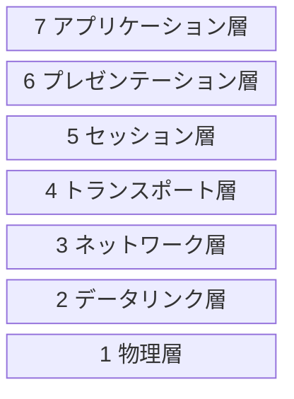

> 
>
> 出典：[オーム社](https://www.ohmsha.co.jp/book/9784274224478/)

--- 
## 書籍概要

1. ネットワーク基礎知識
2. TCP/IP基礎知識
3. データリンク
4. IP(Internet Protocol)
5. IPに関する技術
6. TCPとUDP
7. ルーティングプロトコル
8. アプリケーションプロトコル
9. セキュリティ

---
## 1. ネットワーク基礎知識

#### OSI参照モデル

---
## 2. TCP/IP基礎知識

---
## 3. データリンク

---
## 4. IP(Internet Protocol)

---
## 5. IPに関する技術

---
## 6. TCPとUDP

---
## 7. ルーティングプロトコル

---
## 8. アプリケーションプロトコル

---
## 9. セキュリティ
 

