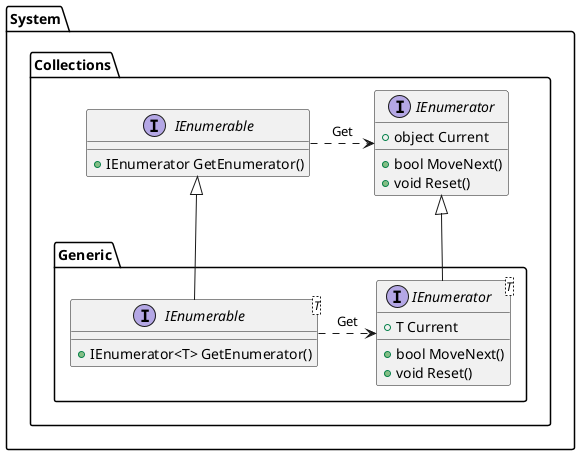

## 概要

[`IEnumerable`][IEnumerable]は**コレクションに対する単純な反復処理をサポートする反復子を提供する**インタフェース．利用側は反復子である[`IEnumrator`][IEnumerator]を介することで，コレクションの実装を知らずとも各要素への反復処理を行える．

それぞれ，非ジェネリック版とジェネリック版が提供されている．また，`IEnumerable`，`IEnumrator`はC#におけるGoFの`Iterator`パターンにあたる．


## コレクションへのアクセス

まず，コレクション走査を基本的な`for`や`while`で行う方法について考えてみる．

#### 配列
配列の場合，`Array[i]`のように添え字で各要素にアクセスできるため，`for(int i=0; i<max; i++)`で走査が可能．

```cs
var array = new int[]{1, 2, ... 10};

for(int i; i< array.Length; i++){
    Console.WriteLine($"i={array[i]}");
}
```

#### 連結リスト

次に以下のような連結リストを考える．
```cs
// リストのノード
class Node {
  public int elem;
  public Node next;

  public Node() : this(0, null){}
  public Node(int val, Node next){
    this.elem = val;
    this.next = next;
  }
}

// 連結リスト
class List {
  public Node head;

  public List(){
    head = null;
  }
  public void Add(int val){
    Node node = new Node(val, this.head);
    this.head = node;
  }
}
```

この場合，配列のような添え字でのランダムアクセスは出来ないので，以下のような操作になる．
```cs
List list = new List();
list.Add(7);
list.Add(5);
list.Add(3);

for(Node n=list.head; n!=null; n=n.next) {
  Console.Write("{0}\n", n.elem);
}
```

このようにコレクションの実装が異なれば，`for`や`while`での要素アクセスを対応した形にする必要がある．コレクションごとにコードを変更するのは面倒であり，仕様変更に柔軟に対応できないなどの問題がある．

そこで，コレクションへの共通のアクセス方法を提供するのが`IEnumerable`インターフェースである．


## インターフェース定義

C#の標準コレクションは非ジェネリック版とジェネリック版で，`System.Collections`名前空間と`System.Collections.Generic`名前空間に分かれている．

#### IEnumrator<T>

```cs
public interface IEnumerator<out T> : System.Collections.IEnumrator {
    T Current { get; }
    bool MoveNext();
    void Reset();
}
```

#### IEnumerable<T>

```cs
public interface IEnumerable<out T> : System.Collections.IEnumerable {
    IEnumerator<T> GetEnumerator();
}
```

互換性を維持するために`IEnumerable<T>`は`IEnumerable`を実装するが，現在のC#で非ジェネリックのコレクションを使用することはほぼない．

#### 




#### foreach文

`foreach文`を用いることで`IEnumerable`インタフェースを介した要素へのアクセスを簡単に行える．

```cs
foreach(var item in collection){
    // 任意の処理
}
```

この`foreach文`は以下のように展開される．
```cs
try {
  IEnumerator e = collection.GetEnumerator();
  while(e.MoveNext()){
    var item = e.Current;
    // 任意の処理
  }
}
finally{
  // Dispose処理
}
```

※`foreach`は糖衣構文


#### yield構文


<!-- リンク -->
[IEnumerable]:https://learn.microsoft.com/ja-jp/dotnet/api/system.collections.ienumerable?view=net-9.0
[IEnumerator]:https://learn.microsoft.com/ja-jp/dotnet/api/system.collections.ienumerator?view=net-9.0

[IEnumerable<T>]: https://learn.microsoft.com/ja-jp/dotnet/api/system.collections.generic.ienumerable-1?view=net-8.0
[IEnumerator<T>]: https://learn.microsoft.com/ja-jp/dotnet/api/system.collections.generic.ienumerator-1?view=net-8.0


[System.Collections名前空間]: https://learn.microsoft.com/ja-jp/dotnet/api/system.collections?view=net-6.0
[System.Collections.Generic名前空間]: https://learn.microsoft.com/ja-jp/dotnet/api/system.collections.generic?view=net-9.0