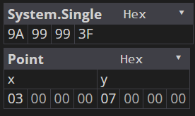
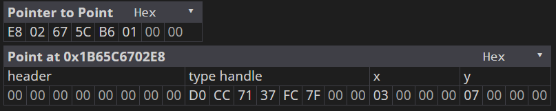
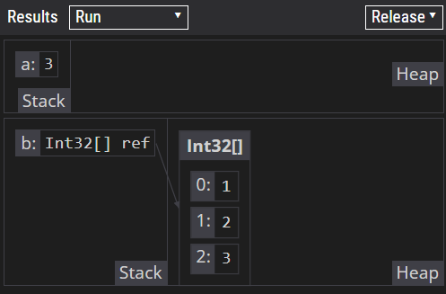

## 概要

C#の参考書や記事を読んでいるとスタックやヒープにメモリを確保するという話がよく出てくるが，なかなか具体的なイメージを持つことができない．そこで[SharpLab][SharpLab]


## SharpLabの機能
SharpLabでは[`Inspect`クラス][Inspectクラス]を利用することでインスタンスに使用されているメモリを確認することができる．主に使用するメソッドは以下の通り．(ドキュメントはないらしい)
  
- SharpLabObjectExtensions
  - Inspect(this object self)

- Inspectクラス
  - Stack()
  - Heap()
  - MemoryGraph()

#### value.Inspect()

`Inspect`メソッドは変数の値を出力するメソッド．拡張メソッドとして定義されているため，以下のように呼び出せる．

```cs
int num = 5;
string str = "Hello";

num.Inspect();
str.Inspect();
str.Inspect("title");   // ※引数でタイトルを設定できる
```


[リンク](https://sharplab.io/#v2:EYLgHgbALANALiATgVwHYB8CWq4AJXIC2uAvLgKwDcAsAFAACAjAAy4DOcipuARABIBTADZCA9jxq06BQgDoAkqjYAHAQGM4ACgCUkjogVLVGnXs6GV6rTziY4QgT11A)


#### Inspect.Stack()
指定した値がスタック上でどのように配置されているか確認できるメソッド．

```cs
var num = 1.2f;
var point = new Point(3,7); 

Inspect.Stack(num);
Inspect.Stack(point);

struct Point{
    public int x;
    public int y;
    public Point(int x, int y) => (this.x,this.y) = (x,y);
}
```


[リンク](https://sharplab.io/#v2:C4LgTgrgdgPgbgQzAAihAtsgvMgjAOgCYAzAbgFgAoRFABwHsBLKYbVAUwHdkAFJlgBQBmADQB2AJSlkVKgEkoAZ1rsAxsHwBlYAlUBrAWnRT5Sleq079Ahs2AnKVRcEjre/YAG8qyX8gACQsh2yAAeFJR+AUEhAJ4RUYHudgIhoSLBLMixEtgAfMgCwAAWjIr46SVl+DlsAuk5EQC+QA===)

#### Inspect.Heap()
指定した値がヒープ上でどのように配置されているか確認できるメソッド．

```cs
var point = new Point(3,7); 

Inspect.Stack(point);
Inspect.Heap(point);

class Point{
    public int x;
    public int y;
    public Point(int x, int y) => (this.x,this.y) = (x,y);
}
```



[リンク](https://sharplab.io/#v2:C4LgTgrgdgPgbgQzAAgA4HsCWVjILzJQCmA7sgApY4AUAzADQDsAlANzICwAUNwJJQBnVEQDGwAHQBlYAhEBrahmzA2fQcLHiAEkQSpFVFa27cAAgCYKhgN7dk95KdrJlyAB7GuDx89cBPT28nK2VqVzd6FxxkP2Z8AD5kamAAC0wBcQjU9PFY/CSI2M8AX24gA=)


また，確保された領域の先頭には`header`と`type_handle`という各8byteの領域が存在するしている．これらは「オブジェクトの状態（例えばlook()とかすると変わるらしい）」や「型情報」に関するヘッダーで，ヒープにデータを格納する際には必ずついてくるらしい．


#### Inspect.MemoryGraph()

```cs
int a = 3;
Inspect.MemoryGraph(a);

int[] b = new[]{1, 2, 3};
Inspect.MemoryGraph(b);
```


[リンク](https://sharplab.io/#v2:C4LgTgrgdgPgllYACAhkgvEgzAbgLABQAAgEwCsKAlPgYQsANoC6SARhklAKYDuzA3gEYANEhKisAXxqkyrakA==)


## 組み込み型の使用メモリ


**値型**
| キーワード | 型名             | メモリ使用量 | 値の範囲（min ～ max                                    | 備考                               |
| ---------- | ---------------- | ------------ | ------------------------------------------------------- | ---------------------------------- |
| `byte`     | `System.Byte`    | 1 byte       | 0 ～ 255                                                | 符号なし 8 ビット整数              |
| `sbyte`    | `System.SByte`   | 1 byte       | -128 ～ 127                                             | 符号付き 8 ビット整数              |
| `short`    | `System.Int16`   | 2 bytes      | -32,768 ～ 32,767                                       | 符号付き 16 ビット整数             |
| `ushort`   | `System.UInt16`  | 2 bytes      | 0 ～ 65,535                                             | 符号なし 16 ビット整数             |
| `int`      | `System.Int32`   | 4 bytes      | -2,147,483,648 ～ 2,147,483,647                         | 符号付き 32 ビット整数             |
| `uint`     | `System.UInt32`  | 4 bytes      | 0 ～ 4,294,967,295                                      | 符号なし 32 ビット整数             |
| `long`     | `System.Int64`   | 8 bytes      | -9,223,372,036,854,775,808 ～ 9,223,372,036,854,775,807 | 符号付き 64 ビット整数             |
| `ulong`    | `System.UInt64`  | 8 bytes      | 0 ～ 18,446,744,073,709,551,615                         | 符号なし 64 ビット整数             |
| `float`    | `System.Single`  | 4 bytes      | ±1.5 × 10⁻⁴⁵ ～ ±3.4 × 10³⁸                             | 単精度浮動小数点                   |
| `double`   | `System.Double`  | 8 bytes      | ±5.0 × 10⁻³²⁴ ～ ±1.7 × 10³⁰⁸                           | 倍精度浮動小数点                   |
| `decimal`  | `System.Decimal` | 16 bytes     | ±1.0 × 10⁻²⁸ ～ ±7.9 × 10²⁸                             | 高精度浮動小数点（金融計算向け）   |
| `char`     | `System.Char`    | 2 bytes      | `'\u0000'` (0) ～ `'\uffff'` (65,535)                   | UTF-16 の 1 文字                   |
| `bool`     | `System.Boolean` | 1 byte       | `true` または `false`                                   | メモリ使用量は最適化される場合あり |

**参照型**
| キーワード | 型名            | メモリ使用量 | 値の範囲（min ～ max | 備考                   |
| ---------- | --------------- | ------------ | -------------------- | ---------------------- |
| `object`   | `System.Object` | 参照型       | -                    | すべての型の基底クラス |
| `string`   | `System.String` | 参照型       | -                    | 不変の文字列（UTF-16） |


#### 

```cs

```


## 参考資料
- [_: Sharplab のMemoryGraph を使ってメモリの状態を確認する](https://tech.guitarrapc.com/entry/2019/02/14/055953)
- [hatena: sharplab-inspect の使い方](https://shikaku-sh.hatenablog.com/entry/c-sharp-how-to-use-sharplab-inspect)
- [_: SharpLabを使ったC#のメモリ管理の確認](https://soft-rime.com/post-9359/#google_vignette)
- [未確認飛行C: 組込み型](https://ufcpp.net/study/csharp/st_embeddedtype.html)

<!-- リンク -->
[SharpLab]: https://sharplab.io/
[Inspectクラス]: https://github.com/ashmind/SharpLab/blob/main/source/Runtime/Inspect.cs
[SharpLabObjectExtensionsクラス]: https://github.com/ashmind/SharpLab/blob/main/source/Runtime/SharpLabObjectExtensions.cs


[組み込み型]: https://learn.microsoft.com/ja-jp/dotnet/csharp/language-reference/builtin-types/built-in-types