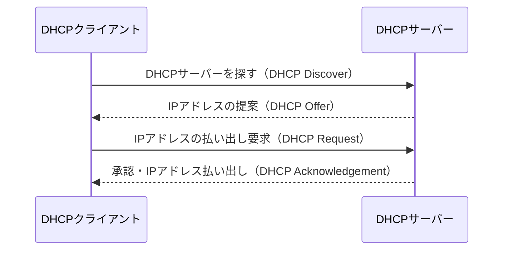
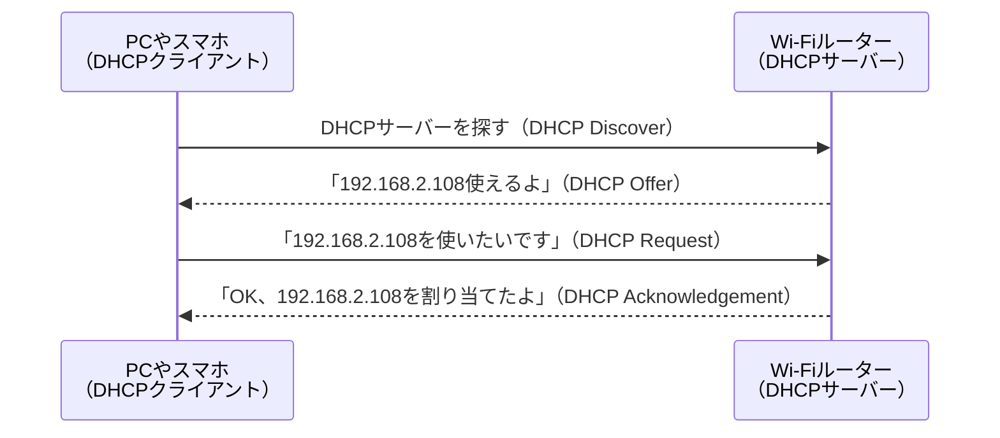

---
## DHCPとは？
`DHCP（Dynamic Host Configuration Protocol）` はIPアドレスを自動で配る仕組み．

家庭用ルーターには、必ずDHCPサーバーが内蔵されている．

#### DHCPの仕組み

`DHCPサーバー`と`DHCPクライアント`で行われる．
(Discover → Offer → Request → Acknowledgement)

例えば，「家庭用ルータでPCやスマホをネットに繋ぐ」場合は，以下のようになる．

この仕組みのおかげで、ユーザーは何もしなくても通信できる．

#### プロトコルの詳細

- トランスポート層は，コネクションレスの`UDP`を使用
- サーバ側のポート番号は`67番`，クライアント側のポート番号は`68番`

#### DHCPの欠点

便利な`DHCP`だが以下のような欠点もある．

| 弱点                               | 影響する場面                                                                                                               |
| :--------------------------------- | :------------------------------------------------------------------------------------------------------------------------- |
| いつも同じIPがもらえるとは限らない | - NAS、プリンタ、サーバーなど「固定でアクセスしたい機器」が困る - アプリで「192.168.2.108に接続」と決め打ちするとズレる |
| リース切れでIP変更されることがある | ルーターが再起動したり、機器が電源オフしていると、違うIPが配られることがある                                               |

よって，一部の機器には固定IPを設定した方がよい．

--- 
## 固定IPアドレス

---
##
- _: [DHCPとは？しくみからわかりやすく解説！](https://www.hcnet.co.jp/column/detail47.html)
- youtube: [DHCP／フローを徹底解説【情報処理技術者試験／高校情報１／応用情報・基本情報・支援士】](https://www.youtube.com/watch?v=PNDoemWWs54)
