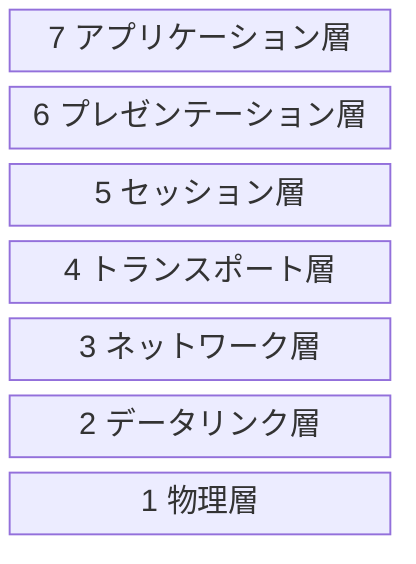
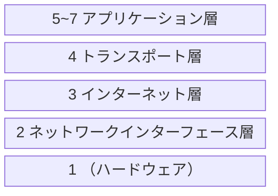

> 
>
> 出典：[オーム社](https://www.ohmsha.co.jp/book/9784274224478/)


--- 
## 書籍概要

1. ネットワーク基礎知識
2. TCP/IP基礎知識
3. データリンク
4. IP(Internet Protocol)
5. IPに関する技術
6. TCPとUDP
7. ルーティングプロトコル
8. アプリケーションプロトコル
9. セキュリティ


---
## 1. ネットワーク基礎知識


#### OSI参照モデル



回路交換方式 と パケット交換方式

- ユニキャスト
- ブロードキャスト
- マルチキャスト
- エニーキャスト


| 機器                         | 役割 |
| ---------------------------- | ---- |
| ネットワークインターフェース |      |
| リピーター                   |      |
| ブリッジ    / Layer2スイッチ |      |
| ルーター    / Layer3スイッチ |      |
| Layer4-7スイッチ             |      |
| ゲートウェイ                 |      |

#### リピーター
- 減衰して変形した信号の波形を増幅・整形して流す装置
- ネットワークを**物理層**で延長する

#### ブリッジ

#### ルーター

#### 

#### ゲートウェイ

---
## 2. TCP/IP基礎知識


モデル化の考え方
- OSI参照モデル : 通信プロトコルに必要な機能は何か
- TCP/IP :プロトコルをコンピュータに実装するにはどのようにプログラミングしたらよいか





#### ネットワークインターフェース層

---
## 3. データリンク


---
## 4. IP(Internet Protocol)


IPアドレスは「ネットワーク部」と「ホスト部」で構成される．
32bitをこの２つにどう割り当てるかは，クラスによる固定分割とサブネットマスクによる可変分割がある．

※ 現代ではクラスベースの割り当ては廃止され、「CIDR（Classless Inter-Domain Routing）」方式で柔軟に管理されている．


#### クラス

| クラス | 先頭ビット | アドレス範囲                   | 用途               | デフォルトサブネットマスク |
| ------ | ---------- | ------------------------------ | ------------------ | -------------------------- |
| A      | 0xxx...    | `1.0.0.0`〜`126.255.255.255`   | 大規模ネットワーク | `255.0.0.0 (/8)`           |
| B      | 10xx...    | `128.0.0.0`〜`191.255.255.255` | 中規模             | `255.255.0.0 (/16)`        |
| C      | 110x...    | `192.0.0.0`〜`223.255.255.255` | 小規模             | `255.255.255.0 (/24)`      |
| D      | 1110...    | `224.0.0.0`〜`239.255.255.255` | マルチキャスト用   | -                          |
| E      | 1111...    | `240.0.0.0`〜`255.255.255.255` | 研究・実験用       | -                          |


#### サブネットマスク


#### IPv4 ヘッダー


```mermaid
block-beta


```


---
## 5. IPに関する技術


---
## 6. TCPとUDP


---
## 7. ルーティングプロトコル


---
## 8. アプリケーションプロトコル


---
## 9. セキュリティ
 


