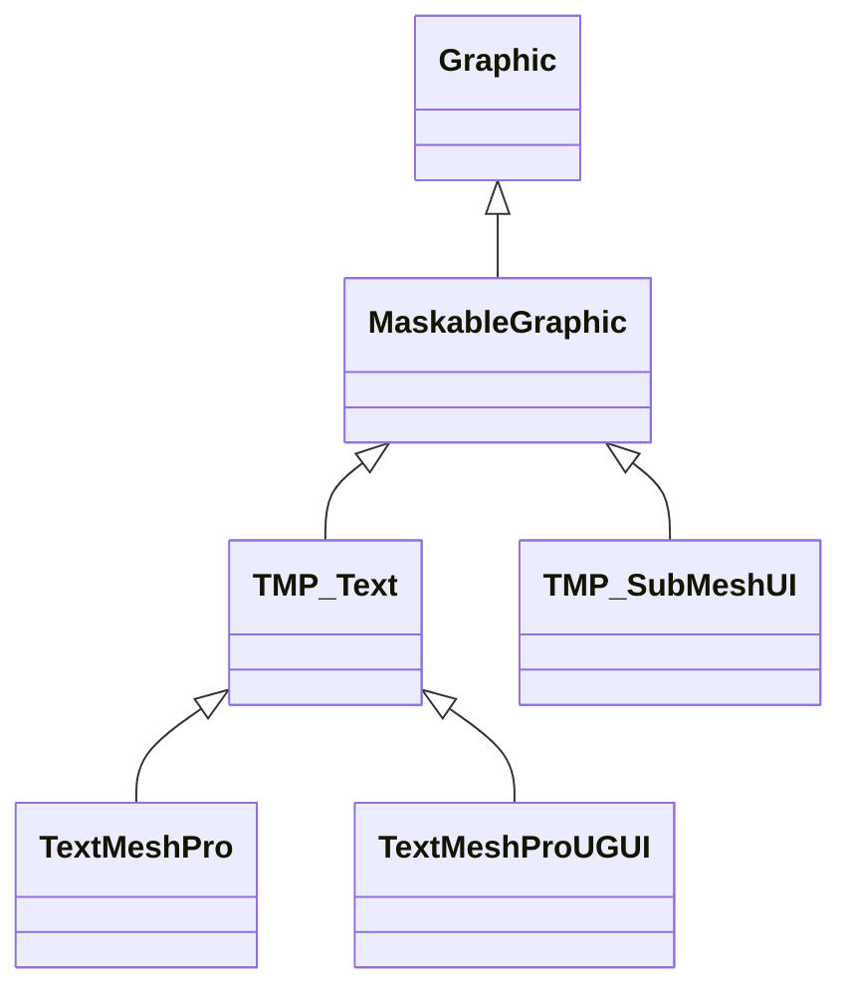

`TextMeshProUGUI` のインスペクタ設定に関するメモ書き．

## TextMeshPro

## TextMeshProの設定値

`TextMeshProUGUI`のインスペクタでは下記の項目を設定できる

- **Text Input**
- Main Settings
  - Font Asset
  - Material Preset
  - Font Size
  - Vertex Color
  - Color Gradient
  - Override Tags
  - Spacing Options
  - Alignment
  - Text Wrapping Mode
  - Horizontal Mapping
  - Vertival Mapping
- Extra Settings

## 1. Text Input

## 2. Main Settings

## 3. Extra Settings

## 参考資料

- hatena: [【Unity】TextMesh Proをアニメーションさせる～プログラマ編～](https://coposuke.hateblo.jp/entry/2020/06/07/020330)

<!-- リンク |  -->
[TextMeshPro マニュアル]: https://docs.unity3d.com/ja/Packages/com.unity.textmeshpro@3.0/manual/index.html
[TextMeshPro スクリプトAPI]: https://docs.unity3d.com/ja/Packages/com.unity.textmeshpro@3.0/api/TMPro.html
