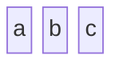
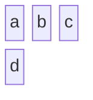
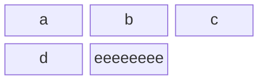
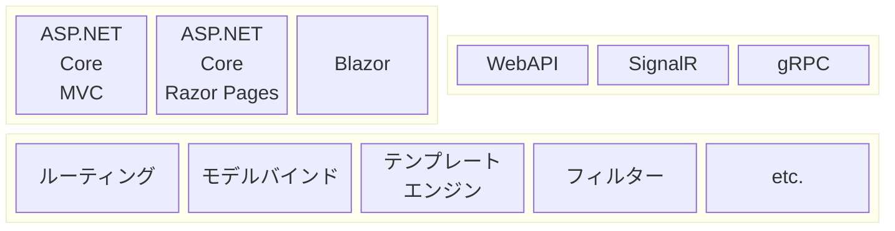
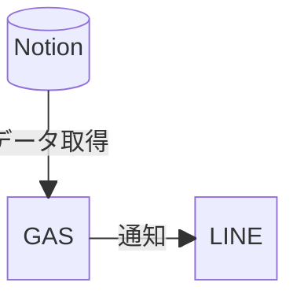

[ドキュメント](https://mermaid.js.org/syntax/block.html)

## 基本

できること
- **列幅**を指定する
- スペースを挟む

できないこと
- **行幅**を指定する

---
#### シンプルなブロック図

空白を挟んで要素を列挙すると，ブロック要素として認識される．以下では `a` `b` `c` のブロックがつくられる．

```
block-beta
  a b c
```


１行に含める要素数は`colums` で指定できる．指定した値を超えると改行する．

```
block-beta
  columns 3
  a b c d
```


同じ要素は
- `columns`を複数回呼んだ場合は，最後（最新）の呼び出しが適用される
- 同名の要素は無視（スキップ）される
- 要素のサイズは全て同じで，最大の要素に合わせる

```
block-beta
  columns 5
  columns 3
  a b c d d d d d d eeeeeeee
```


---
#### 


---
#### 高度なブロック構成


```mermaid
```


---
## ケーススタディ


```mermaid
block-beta
  r ["ルーティング"]
  m ["モデルバインド"]
  t ["テンプレート<br>エンジン"]
  f ["フィルター"]
  e ["etc."]
```

---



---





## 

## 

---
## 参考
- hatena: [Mermaidでブロック図を書いてみる（作成手順も記載）](https://miya-moto-memo.hatenablog.com/entry/2024/06/28/183000)
