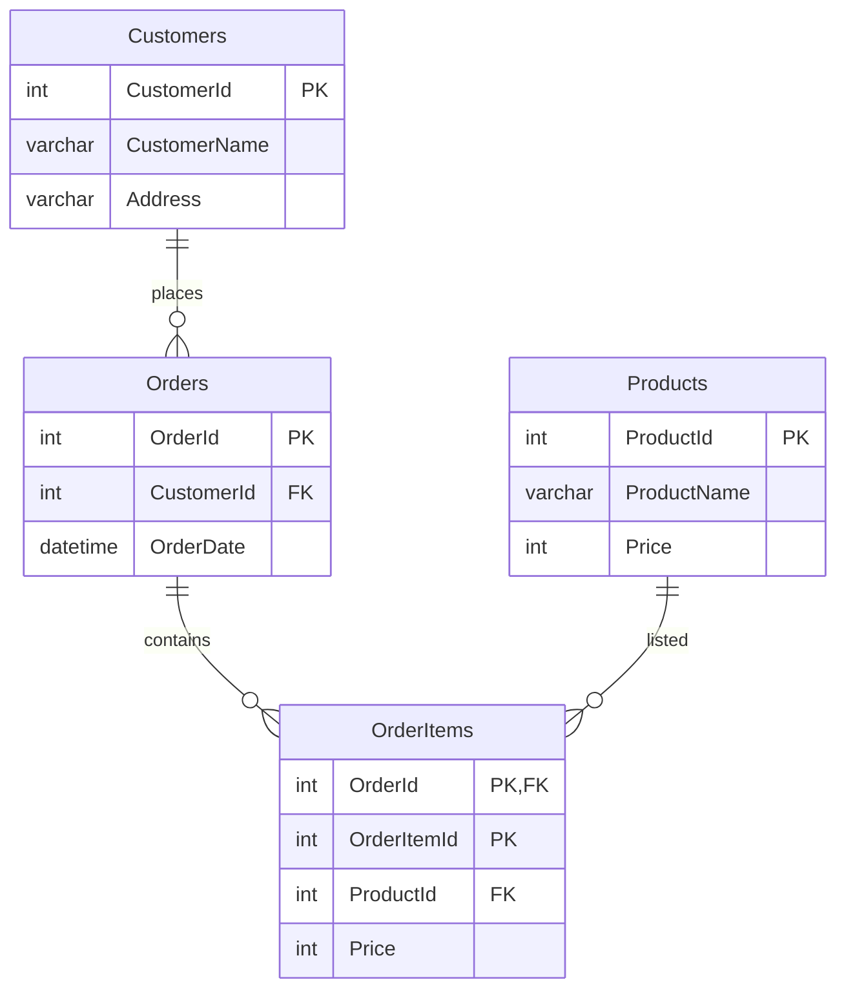

[Udemy](https://www.udemy.com/course/anderson_sqlinit/?couponCode=KEEPLEARNING)


--- 
## 講座概要

- [x] 1. インストール 
- [x] 2. テーブルの作成
- [x] 3. 基本的なSQL
- [x] 4. テーブル設計と正規化
- [x] 5. 結合＆並び替え


--- 
## 1. インストール 

`SQL Server 2022` をインストールする．
[ダウンロードサイト](https://www.microsoft.com/ja-jp/sql-server/sql-server-downloads)


`SSMS`をインストールする．
[ダウンロードサイト](https://learn.microsoft.com/ja-jp/ssms/download-sql-server-management-studio-ssms?redirectedfrom=MSDN)


※日本語版は以下のリンク部から取得する．


SSMSダウンロード_日本語
--- 
## 2. テーブルの作成

--- 
## 3. 基本的なSQL

- `select`
- `where`

--- 
## 4. テーブル設計と正規化





--- 
## 5. 結合＆並び替え

`Order`と`OrderItems`の結合

```sql
select * from Orders A
inner join OrderItems B
on a.OrderId = b.OrderId
```

`inner join` `left outter join`

