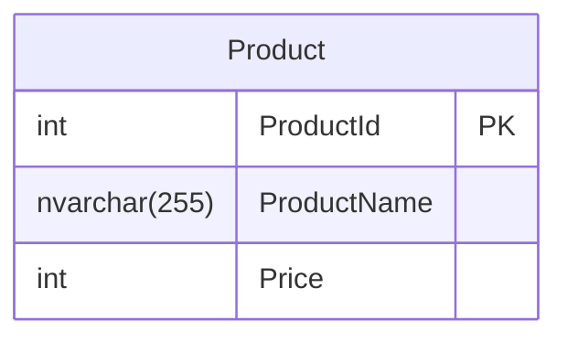

[Udemy](https://www.udemy.com/course/efcorebasic/?couponCode=KEEPLEARNING)

---
## 講座概要

- [ ] 1. データベースとの接続 
- [ ] 2. EntityFrameworkCoreでの接続（DBファースト）
- [ ] 3. フィルタリング
- [ ] 4. 結合（Join）
- [ ] 5. EFCoreのログ出力
- [ ] 6. Includeを使った結合
- [ ] 7. データ更新
- [ ] 8. マイグレーションを使ったコードファースト
- [ ] 9. 多対多のリレーション
- [ ] 10. 排他制御


--- 
## 1. データベースとの接続 

`Visual Studio 2022` では
SQLServerオブジェクトエクスプローラーから`MSSQLLocalDB`

#### NuGetパッケージの追加
プロジェクトに `Microsoft.Data.SqlClient` パッケージを追加する．
（※`System.Data.SqlClient`もあるが，こちらはもう更新されていない）


#### 

```cs
var builder = new SqlConnectionStringBuilder();
builder.DataSource = "(localdb)\\MSSQLLocalDB";
builder.InitialCatalog = "AndersonA";
builder.IntegratedSecurity = true;          // Windows Authentication
```

```cs
string sql = "select getdate()";
var dt = new DataTable();
using (var connection = new SqlConnection(builder.ConnectionString))
using (var adapter = new SqlDataAdapter(sql, connection)) {
    connection.Open();
    adapter.Fill(dt);   // fill the DataTable with the result of the query
}
```

--- 
## 2. EntityFrameworkCoreでの接続（DBファースト）




--- 
## 3. フィルタリング


--- 
## 4. 結合（Join）

--- 
## 5. EFCoreのログ出力


--- 
## 6. Includeを使った結合

--- 
## 7. データ更新

--- 
## 8. マイグレーションを使ったコードファースト

--- 
## 9. 多対多のリレーション

--- 
## 10. 排他制御


