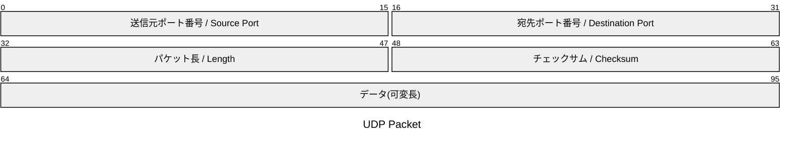

UDP通信を行いたい場合，`UdpClient (System.Net.Sockets名前空間)` を使用する．

---
## 

| ユースケース                           | 説明                                                        |
| -------------------------------------- | ----------------------------------------------------------- |
| **LAN内のデバイス検出**                | ブロードキャストで一斉に探す（例：プリンタ・IoT機器の発見） |
| **リアルタイム通信（多少のロス許容）** | ゲーム、音声通話、センサー値のストリーミング                |
| **監視・ログ送信**                     | ログサーバに非同期に送る、多少欠損しても可                  |
| **軽量なリクエスト／レスポンス通信**   | 小規模な通信でTCP接続のオーバーヘッドを避けたい場合         |

--- 
## UDPヘッダ

---
## 参考記事
- qiita: [C# UdpClientの使い方解説](https://qiita.com/GaneDev/items/6d5df6444eae2d5f5cf0)

<!-- Link -->
[MS Doc: UdpClientクラス]: https://learn.microsoft.com/ja-jp/dotnet/api/system.net.sockets.udpclient?view=net-8.0
