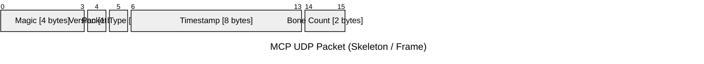

---
## mocopiとは

#### デバイス

> **mocopi 本体**
> 
> 
> **mocopiセンサーデータレシーバー**
> 
> 
> ※画像出典：[ソニー公式 mocopi 製品ページ](https://www.sony.jp/mocopi/)

名前の由来は，「モーション(motion)をコピー(copy)する」からきているらしい．

#### 関連ソフト

- mocopi スマートフォンアプリ
- mocopi PC アプリ
- XYN Motion Studio
- mocopi VR アプリ
- mocopi link アプリ

--- 
## データ送信

通信プロトコル : UDP
ポート番号 : 12351 (デフォルト) 

※複数アバターのモーションを受診する場合は，個別のUDPポート番号を使用する．

--- 
#### スケルトン定義（Bone構造）

> 
> 
> ※画像出典：[ソニー公式 mocopi 技術仕様](https://www.sony.co.jp/en/Products/mocopi-dev/jp/documents/Home/TechSpec.html)

| Index | Joint Name | Index | Joint Name |
| ----- | ---------- | ----- | ---------- |
| 0     | root       | 14    | l_hand     |
| 1     | torso_1    | 15    | r_shoulder |
| 2     | torso_2    | 16    | r_up_arm   |
| 3     | torso_3    | 17    | r_low_arm  |
| 4     | torso_4    | 18    | r_hand     |
| 5     | torso_5    | 19    | l_up_leg   |
| 6     | torso_6    | 20    | l_low_leg  |
| 7     | torso_7    | 21    | l_foot     |
| 8     | neck_1     | 22    | l_toes     |
| 9     | neck_2     | 23    | r_up_leg   |
| 10    | head       | 24    | r_low_leg  |
| 11    | l_shoulder | 25    | r_foot     |
| 12    | l_up_arm   | 26    | r_toes     |
| 13    | l_low_arm  |       |            |

#### パケット構造

    16-     : Bones[]        [40 × count bytes] repeat
        - 0-3   : Bone ID        [4 bytes]   
        - 4-19  : Rotation       [4×4 bytes] 
        - 20-31 : Position       [3×4 bytes] 
        - 32-39 : Reserved       [8 bytes]   

---
## 

mocopiはモーションデータを[`BVH形式`][wikipedia: Biovision Hierarchy]で保存する．

---
## mocopi SDK

[公式サイト][mocopi SDKダウンロード]で以下のSDKがダウンロードできる（2025/05 現在）

- mocopi Reciever Plugin for Unity
- mocopi Reciever Plugin for MotionBuilder
- mocopi Reciever Plugin for Maya
- mocopi Reciever Plugin for Blender
- mocopi sensor data reader
- mocopi Mobile SDK
- BVH Sender

※2024/08 頃に個人でも `mocopi mobile SDK` を利用可能になったとのこと．

---
## その他

#### パケット構造について

- github: [seagetch / mcp-receiver](https://github.com/seagetch/mcp-receiver/blob/main/doc/Protocol.md)
- zenn: [mocopiの通信内容を解析してみた Vol.01](https://zenn.dev/toyoshimorioka/articles/96dbe00b87601f)
- zenn: [mocopiの通信内容を解析してみた Vol.02]()

#### リモートPCに送信する
- zenn: [mocopiの通信をリモートPCに送信する](https://zenn.dev/srgr0/articles/mocopi-remote)

#### 参考記事

- note: [mocopi SDKを触ってみる](https://note.com/oshimu/n/nf81d104955d0)
- qiita: [mocopi SDK（BVH Sender、mocopi Receiver Plugin for Unity）ことはじめ](https://qiita.com/lain_xr/items/86aac3bc533bdae73cbb)
- zenn: [mocopiのUnity SDK触ってみたメモ]()

--- 
## 参考資料

#### mocopi
- qiita: [mocopi のセンサーデータを「VRChat（OSC）」の送信フォーマットで PC に送ってサクッとモニタリング（Protokol アプリを利用）](https://qiita.com/youtoy/items/c2cd8c3464fa4edda810)
- qiita: [mocopi のアニメーションデータbvhをfbxに変換する](https://qiita.com/afjk/items/334b69727ea473a53190)

#### BVH
- qiita: [BVHの仕様を調査してみた](https://qiita.com/matchyy/items/ee99fb28110e4614323f)
- hatena: [UnityでPerfumeを踊らせる](https://nn-hokuson.hatenablog.com/entry/2016/07/21/212313)

- youtube: [「俺だけレベルアップな件」アニメ制作の舞台裏 | mocopi | ソニー公式](https://www.youtube.com/watch?v=lx_bNKbFJA8&t=168s)

<!-- Link -->
[バンダイナムコ研究所のモーションキャプチャデータセット]: https://github.com/BandaiNamcoResearchInc/Bandai-Namco-Research-Motiondataset/tree/master

[wikipedia: Biovision Hierarchy]: https://ja.wikipedia.org/wiki/Biovision_Hierarchy

<!-- Link | mocopi公式 -->
[mocopi ヘルプガイドpdf]: https://helpguide.sony.net/mobile/qm-ss1/v1/ja/print.pdf

[mocopi 技術仕様]: https://www.sony.co.jp/en/Products/mocopi-dev/jp/documents/Home/TechSpec.html
[mocopi SDKダウンロード]: https://www.sony.co.jp/en/Products/mocopi-dev/jp/downloads/DownloadInfo.html

<!-- Link -->
[1]: https://www.sony.jp/mocopi/info/20240830.html?srsltid=AfmBOoqh4NJaMqbKSlEAYiylpfho8eyELJPVmYwRTcYTceiXB13t2np0

