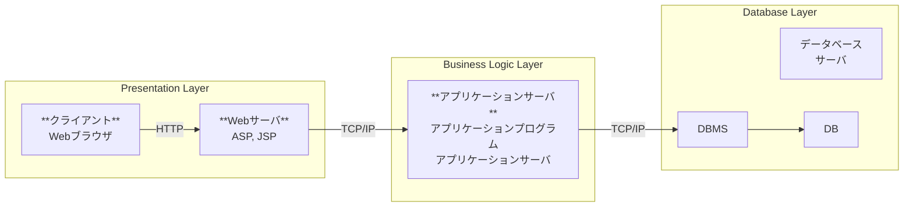

筑波大学「データベース概論Ⅰ」

## 講義概要

#### 講義の目標

1. データベースシステムの基本概念と役割 (1)
2. データベースの概念と実体関連モデル (2)
3. リレーショナルデータベースに関する基本知識 
   1. リレーショナルデータモデルの基礎(3~4)
   2. 主な正規形とデータベース設計 (5~6)
   3. 問い合わせ言語SQL (7)
4. 効率的なデータ処理の基礎技術 (8~10)

#### キーワード

- データベース
- リレーショナルデータベース
- データモデル
- SQL
- データベース設計

#### 進捗

- [x] 第1週：DBの概要と構成
- [ ] 第2週：データモデリングとERモデル
- [ ] 第3週：リレーショナルモデルと代数
- [ ] 第4週：リレーショナル理論とドメイン理論
- [ ] 第5週：正規化（第3正規形まで）
- [ ] 第6週：高次の正規形と設計原則
- [ ] 第7週：SQLとホスト言語からの利用
- [ ] 第8週：物理格納（ヒープ・ハッシュ・索引）
- [ ] 第9週：B木・B+木・二次索引
- [ ] 第10週：問合せ処理と最適化

---

## データベースシステムとは

