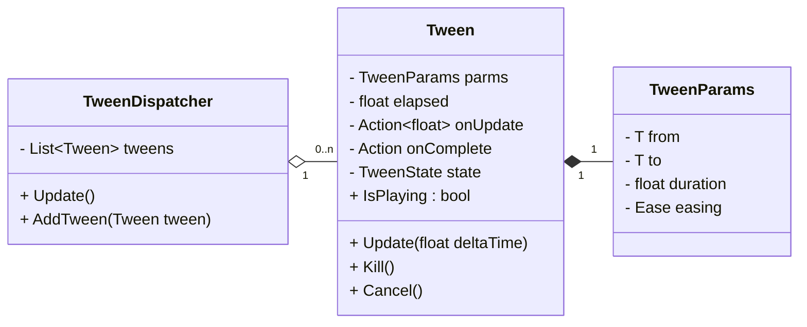
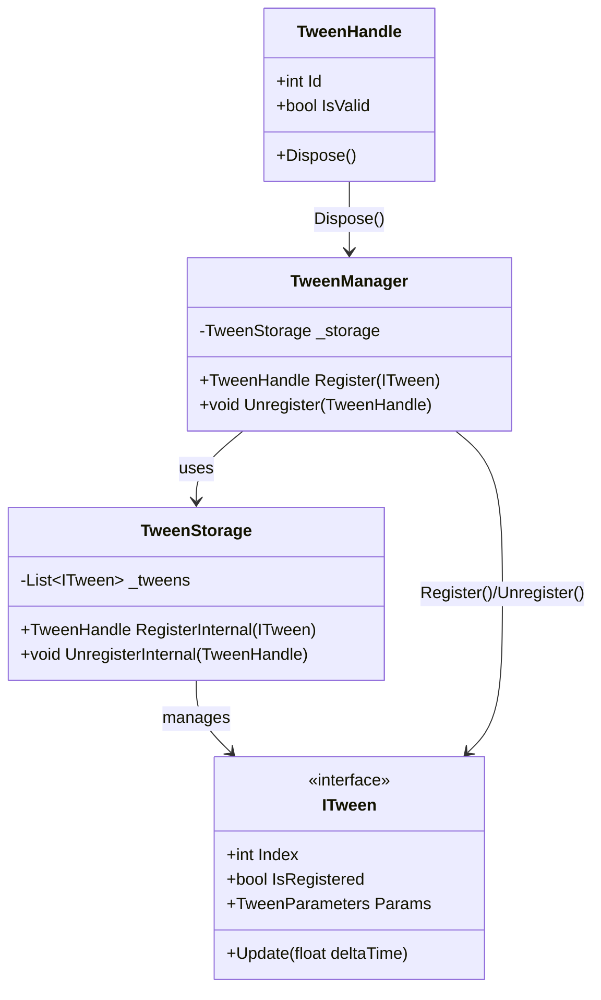

---
## 1. バッチ処理

`MonoBehaviour`のUpdateはそれなりにコストがあるため，Teenインスタンスの更新は管理クラスを設けてバッチ処理化する．処理のキャンセルを行いたいので，Tweenインスタンスには`Kill()`，`Cancel()`メソッドを用意する．




#### 1.1 インスタンスの登録・解除

またユーザにTweenインスタンスを直接触らせないようにするため，操作用の`TweenHandle`を変えす設計とする．



**ITween**
```cs
public interface ITween {
    public int Index { get; set; }
    public bool IsRegistered { get; }
    :
}
```

**TweenStorage**
```cs
internal sealed class TweenStorage {
    private readonly List<ITween> _tweens = new();

    // 登録
    public TweenHandle Register(ITween tween) {
        if (tween.IsRegistered)
            Error.TweenAlreadyRegistered();

        // 対象の登録
        var index = _tweens.Count;
        tween.Index = index;
        _tweens.Add(tween);

        return new TweenHandle(index);
    }

    // 登録解除
    public void Unregister(TweenHandle handle) {
        int removeIndex = handle.Id;
        if (removeIndex < 0 || removeIndex >= _tweens.Count)
            return;

        var lastIndex = _tweens.Count - 1;

        // 対象の登録解除
        var removedTween = _tweens[removeIndex];
        removedTween.Index = -1;

        // 末尾要素の移動
        if (removeIndex != lastIndex) {
            var lastTween = _tweens[lastIndex];
            _tweens[removeIndex] = lastTween;
            lastTween.Index = removeIndex;
        }
        // リスト更新
        _tweens.RemoveAt(lastIndex);
    }
}
```

**TweenHandle**
```cs
public struct TweenHandle : IDisposable {

    public int Id { get; }

    internal TweenHandle(int id) {
        Id = id;
    }

    public bool IsValid() => Id >= 0;

    public void Dispose() {
        TweenManager.Unregister(this);
    }

    public static TweenHandle InValid() => new TweenHandle(-1);
}
```


---


--- 
## 2. オブジェクトプール


---


[主要なTweenライブラリのパフォーマンス比較](https://github.com/AnnulusGames/TweenPerformance)

<!-- Link -->
[リポジトリ]: https://github.com/nitou-kanazawa/NTween
