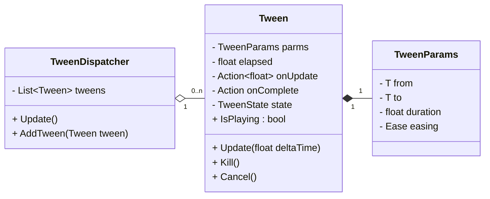

---
## 1. バッチ処理

`MonoBehaviour`のUpdateはそれなりにコストがあるため，Teenインスタンスの更新は管理クラスを設けてバッチ処理化する．処理のキャンセルを行いたいので，Tweenインスタンスには`Kill()`，`Cancel()`メソッドを用意する．




```puml
enum TweenState {
  Idle
  Playing
  Completed
  Canceled
}
```

またユーザに内部処理を意識させないために，外部インターフェースとなるSta


--- 
## 2. オブジェクトプール


---


[主要なTweenライブラリのパフォーマンス比較](https://github.com/AnnulusGames/TweenPerformance)

<!-- Link -->
[リポジトリ]: https://github.com/nitou-kanazawa/NTween
