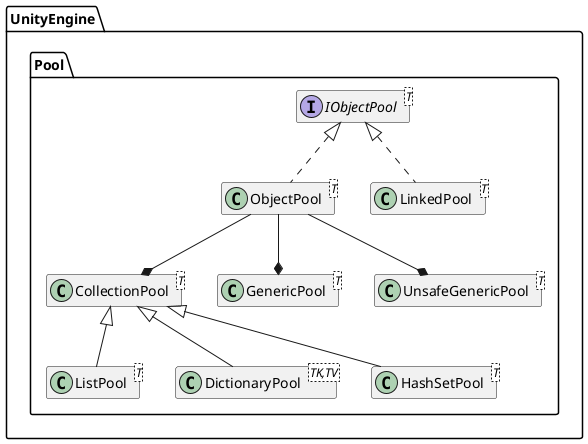

これまでオブジェクトプールを利用する場合は独自実装か，ライブラリ（`UniRx.Toolkit`とか）を導入する必要があったが，`Unity2021.1`からは標準で利用可能になった．

## オブジェクトプール

オブジェクトプール自体はUnity公式の

[ゲームプログラミングパターンでプログラミングをレベルアップ](https://unity3d.jp/game/game-ebooks/level-up-your-code-with-game-programming-patterns/)
[電子書籍の更新より多くのデザインパターンとSOLIDの原則](https://unity.com/ja/blog/game-programming-patterns-update-ebook)

## 標準クラス

オブジェクトプール関連の機能は`UnityEngine.Pool`名前空間に実装されている．

- 通常
  - [`ObjectPool<T0>`][ObjectPool]
  - [`LinkedPool<T0>`][LinkedPool]

- コレクション（Staticアクセス） 
  - [`CollectionPool<T0,T1>`][CollectionPool]
  - [`DictionaryPool<T0,T1>`][DictionaryPool]
  - [`HashSetPool<T0>`][HashSetPool]
  - [`ListPool<T0>`][ListPool]
  
- ジェネリック (Staticアクセス)
  - [`GenericPool<T0>`][GenericPool]
  - [`UnsafeGenericPool<T0>`][UnsafeGenericPool]

## 参考資料
- はなちるのマイノート: [【Unity】Unity公式のObjectPoolを使ってみる(内部実装も一部紹介)](https://www.hanachiru-blog.com/entry/2022/07/25/221600)
- くろくまそふと: [【Unity】オブジェクトプール（Object Pool）の使い方！Unity2021から標準で使えるぞ](https://kurokumasoft.com/2022/05/29/unity-object-pool/)
- qiita: [【Unity】ObjectPoolパターンを使おう！　基本の説明＋やや応用]:(https://qiita.com/Jun_Ishikawa/items/41ef943159694303f320)

<!-- Link -->
[ObjectPool]: https://docs.unity3d.com/6000.0/Documentation/ScriptReference/Pool.ObjectPool_1.html
[LinkedPool]: https://docs.unity3d.com/6000.0/Documentation/ScriptReference/Pool.LinkedPool_1.html
[CollectionPool]: https://docs.unity3d.com/6000.0/Documentation/ScriptReference/Pool.CollectionPool_2.html
[DictionaryPool]: https://docs.unity3d.com/6000.0/Documentation/ScriptReference/Pool.DictionaryPool_2.html
[HashSetPool]: https://docs.unity3d.com/6000.0/Documentation/ScriptReference/Pool.HashSetPool_1.html
[ListPool]: https://docs.unity3d.com/6000.0/Documentation/ScriptReference/Pool.ListPool_1.html
[GenericPool]: https://docs.unity3d.com/6000.0/Documentation/ScriptReference/Pool.GenericPool_1.html
[UnsafeGenericPool]: https://docs.unity3d.com/6000.0/Documentation/ScriptReference/Pool.UnsafeGenericPool_1.html