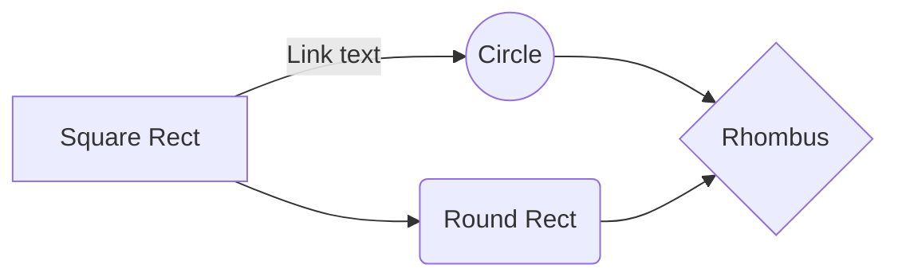
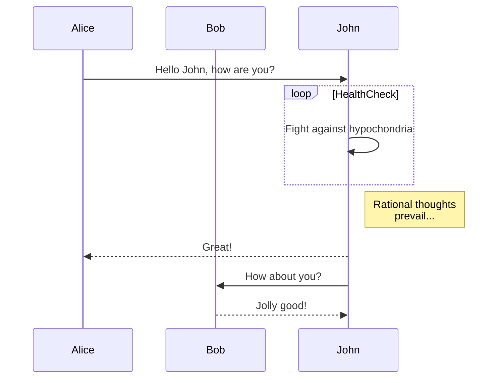
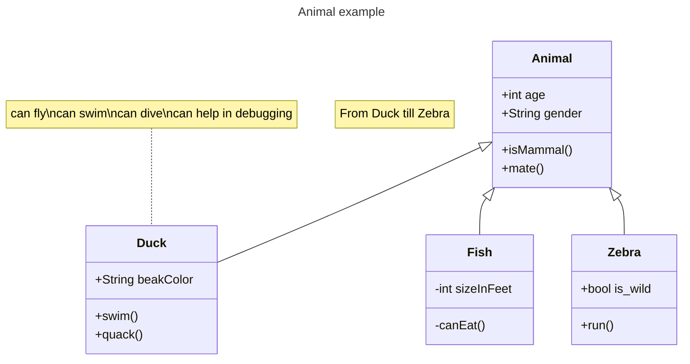
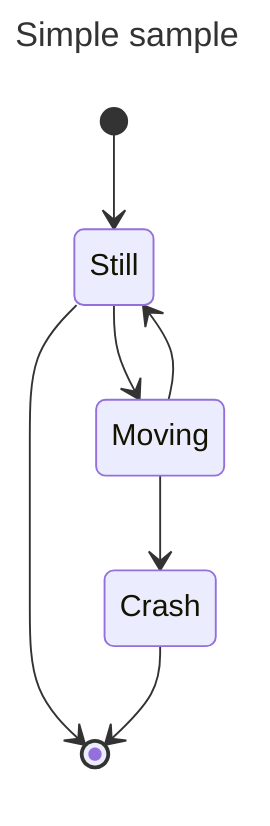
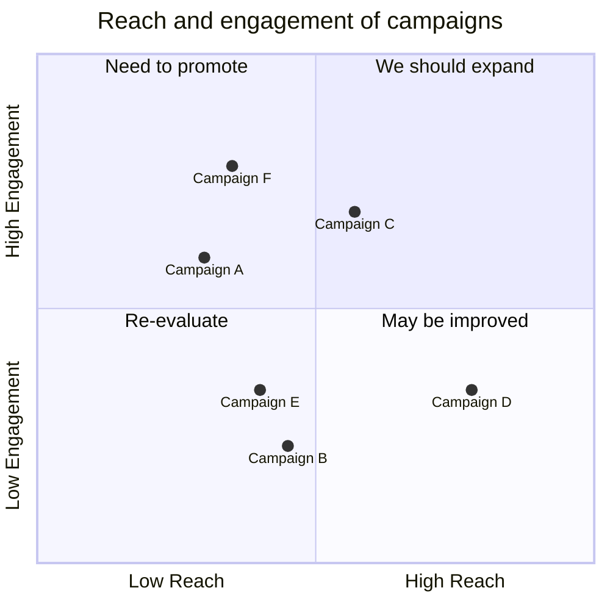
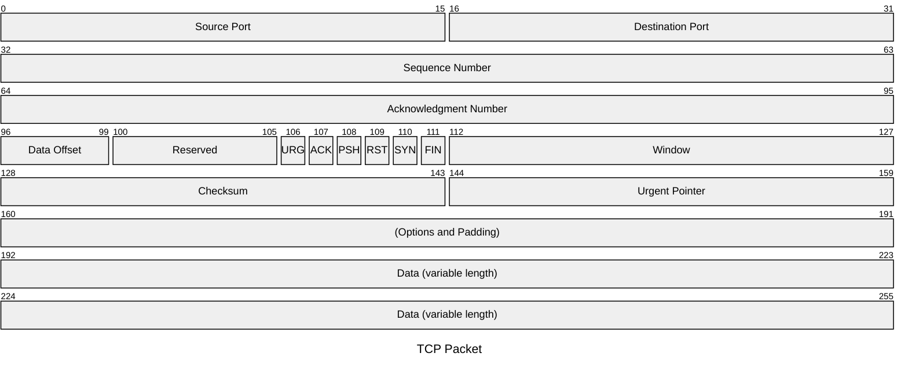
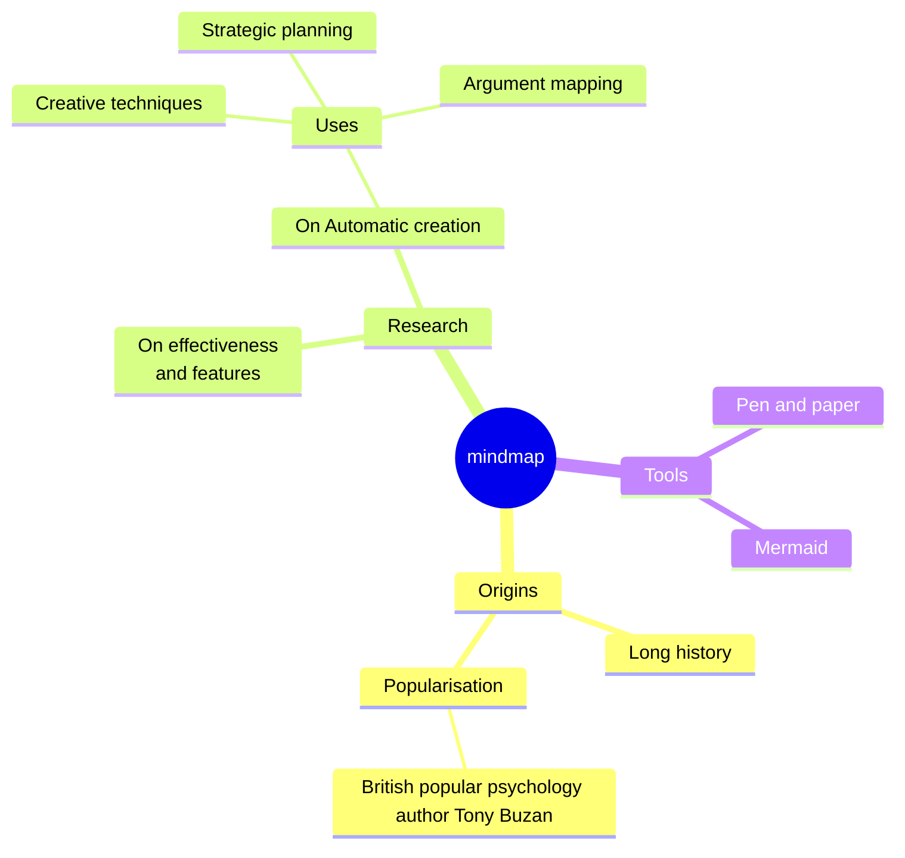
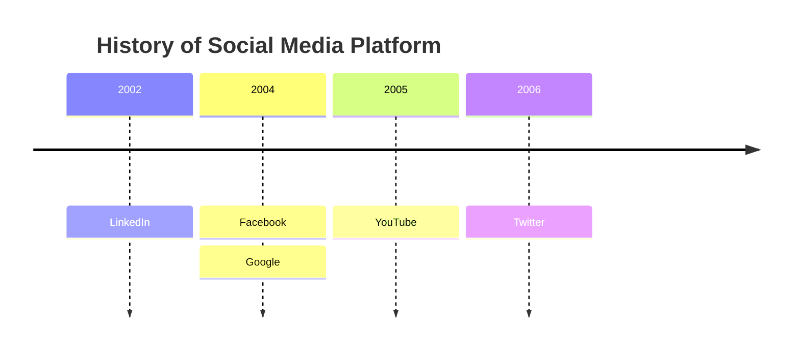
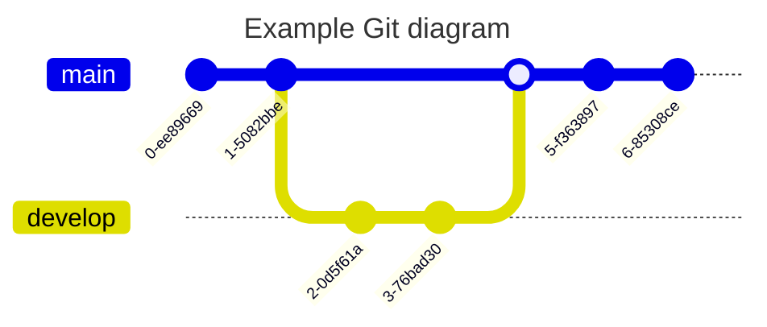

Mermaidはテキストから図

ブラウザ上で動作する[Live Editor](https://mermaid.live/edit#pako:eNpVTU1vgkAQ_SubObUJGhQtyKFJxdaLSXvwVPAwkZElurtkWGIt8N-70LRp32ne57RwNDlBDKeLuR4lshX7TaaFw1OaSC5rq7A-iMnksduSFcpounVifbc1opamqkpd3H_n10NIJO1uiJGwstTn_ttKxv6rpk5s0h1W1lSHv87-ajrxnJZv0s3_dySTa72kJ4xPODkiiwR5jIAHBZc5xJYb8kARKxwotIObgZWkKIPYnTnyOYNM965ToX43Rv3U2DSFBLd9qR1rqhwtbUosGNWvyqRz4sQ02kIcrFbjCMQtfDg6n_ojlrP5IphFoQc3p0bhNIwe_CgIFr4_C-a9B5_jV38ahcv-CyVMcy0)もある．

---

Mermaidでは以下の図を作成できる。

- フローチャート
- シーケンス
- クラス図
- 状態遷移
- ER図
- ガントチャート
- ユーザジャーニー
- パイチャート
- gitグラフ
  
- Flowchart
- Pie chart diagrams
- Quadrant Chart
- Mindmap
- Timeline Diagram

※以下ではドキュメントに掲載されているサンプルコードを使用している．（11.6.0）

---

## [Flowchart][Mermid - Flowchart]

- 方向を指定できる．（TB,TD,BT,LR,RL）
- サブグラフを指定できる．

---

## [Sequence diagrams][Mermid - Sequence diagrams]

プロセスが互いにどのように動作し，どのような順序で動作するかを示す相互作用図．

---

## [Class diagrams][Mermid - Class diagrams]

---
## [State diagrams][Mermid - State diagrams]

---

## [Quadrant Chart]

---

## [Packet Diagram][Mermid - Packet Diagram]

---

## [Mindmap][Mermid - Mindmap]

- ノードの形を変更できる（四角，円，吹き出し，...）

---

## [Timeline Diagram]

---

## [Gitgraph Diagrams][Mermid - Gitgraph Diagrams]

---

- [Github](https://github.blog/developer-skills/github/include-diagrams-markdown-files-mermaid/)
- [Zenn](https://zenn.dev/zenn/articles/markdown-guide#%E3%83%80%E3%82%A4%E3%82%A2%E3%82%B0%E3%83%A9%E3%83%A0)

## 参考資料
- qiita: [Mermaid記法に入門しよう](https://qiita.com/moikei/items/24e9e5bd8319a10f0115)
- qiita: [【Qiitaでも使える】テキストから図が生成できるMermaidについてのザックリ解説](https://qiita.com/b-mente/items/97a4296666faccd53a72)
- qiita: [テキストから図が生成できるMermaidでAWS構成図をつくる](https://qiita.com/b-mente/items/b17275090176d63d1d69)
- zenn: [mermaidでフローチャートを描く](https://zenn.dev/yuriemori/articles/e097dbd950df86)

<!-- Link -->
[Mermaid ドキュメント]: https://mermaid.js.org/intro/

<!-- Link -->
[Mermid - Flowchart]: https://mermaid.js.org/syntax/flowchart.html
[Mermid - Sequence diagrams]: https://mermaid.js.org/syntax/sequenceDiagram.html
[Mermid - Class diagrams]: https://mermaid.js.org/syntax/classDiagram.html
[Mermid - State diagrams]: https://mermaid.js.org/syntax/stateDiagram.html
[Mermid - Quadrant Chart]: https://mermaid.js.org/syntax/quadrantChart.html
[Mermid - Packet Diagram]: https://mermaid.js.org/syntax/packet.html
[Mermid - Mindmap]: https://mermaid.js.org/syntax/mindmap.html
[Mermid - Gitgraph Diagrams]: https://mermaid.js.org/syntax/gitgraph.html
[Mermid - ]
[Mermid - ]
[Mermid - ]
[Mermid - ]
[Mermid - ]
