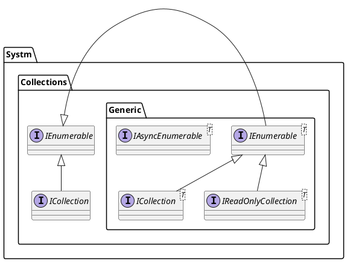
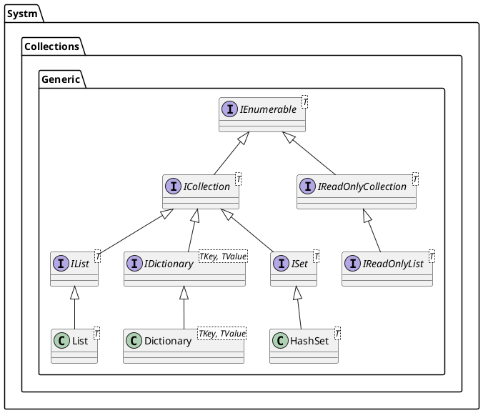

## 概要

標準コレクションは以下の名前空間に属している．

- System.Collections: 
- System.Collections.Generic: ジェネリックコレクション
- System.Collections.ObjectModel: 
- System.Collections.Concurrent: 
- System.Collections.Frozen: 

## System.Collections.Generic

[`System.Collections.Generic`][System.Collections 名前空間]にはジェネリックコレクションと定義するインターフェースとクラスが含まれている．基本的にこれを利用することがほとんど．

- `List<T>`
- `LinkedList<T>`
- `SortedList<T>`
- `Stack<T>`
- `Queue<T>`
- `Dictionary<TKey,TValue>`
- `SortedDictionary<TKey,TValue>`
- `OrderedDictionary<TKey,Value>`
- `HashSet<T>`
- `SortedSet<T>`

#### ICollection

#### IReadOnlyCollection

## System.Collections.ObjectModel
[`System.Collections.ObjectModel`][System.Collections.ObjectModel 名前空間]は

## System.Collections.Concurrent
[`System.Collections.Concurrent`][System.Collections.Concurrent 名前空間]はスレッドセーフなコレクション クラスをいくつか提供する．

## System.Collections.Frozen
[`System.Collections.Frozen`][System.Collections.Frozen 名前空間]は

## 参考資料
- [MS: コレクションとデータ構造](https://learn.microsoft.com/ja-jp/dotnet/standard/collections/?redirectedfrom=MSDN)
- [qiita: 意外と知らない！？ C#の便利なコレクション！](https://qiita.com/hiki_neet_p/items/75bf39838ce580cca92d)

<!-- リンク -->
[System.Collections 名前空間]: https://learn.microsoft.com/ja-jp/dotnet/api/system.collections?view=net-9.0
[System.Collections.Generic 名前空間]: https://learn.microsoft.com/ja-jp/dotnet/api/system.collections.generic?view=net-9.0
[System.Collections.ObjectModel 名前空間]: https://learn.microsoft.com/ja-jp/dotnet/api/system.collections.objectmodel?view=net-9.0
[System.Collections.Concurrent 名前空間]: https://learn.microsoft.com/ja-jp/dotnet/api/system.collections.concurrent?view=net-9.0
[System.Collections.Frozen 名前空間]: https://learn.microsoft.com/ja-jp/dotnet/api/system.collections.frozen?view=net-9.0