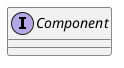

## 概要

**Composite（コンポジット、 混成）** は、 構造に関するデザインパターンの一つで、 オブジェクトからツリー構造を組み立て、 そのツリー構造がまるで独立したオブジェクトであるかのように扱えるようにする．

## 構造

`Composite`パターンは、単純なリーフと複雑なコンテナという、共通のインターフェースを持った二つの基本的な要素型から構成される．コンテナは、リーフ，または他コンテナを子要素として持つ．これにより、木に似た入れ子になった再帰オブジェクト構造を構築できる．

- `Component`
  - ツリーの単純な要素と複雑な要素の両方に共通する操作を記述する．

- `Leaf`
  - 子要素を持たないツリー要素．

- `Container`
  - 子要素を持つツリー要素．
  - 子要素に関する操作は具象クラスではなく`Component`インタフェースを用いて行う．

## 適用例

- **ファイルシステム**
  - FileとDirectory
- **スキルシステム**
  - スキルが複数の効果を持てる
- **敵ユニット**
  - s
- **GUIの階層構造**

## 他パターンとの関連

## まとめ

## 参考資料
- [Guru: Composite](https://refactoring.guru/ja/design-patterns/composite)
- [qiita: Unityで学ぶデザインパターン08: Compositeパターン](https://qiita.com/Cova8bitdot/items/1c57d856027a33e99eb0)