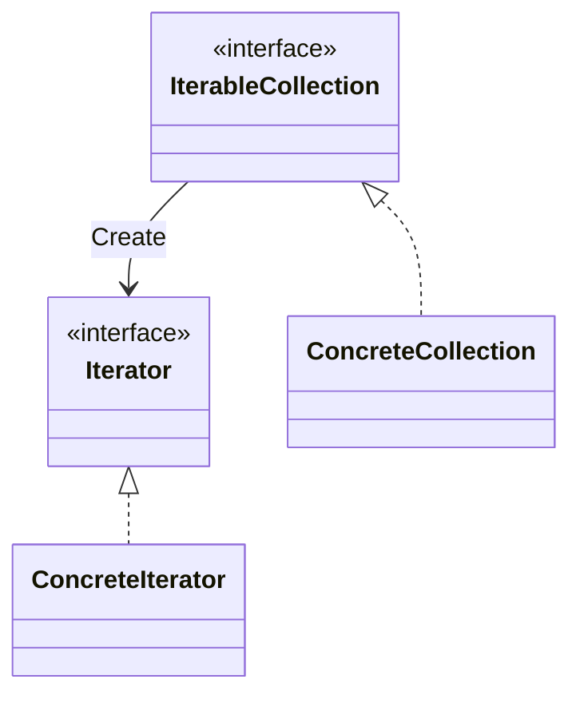

## 概要

`Iterator`（イテレーター，反復子）は，振る舞いに関するデザインパターンの１つで，リスト，スタック，ツリーなどの実際のデータ表現を表に出さずにコレクションの要素を探索することができる．

## 構造

## 適用例

## 他パターンとの関連

- `Composit`は再帰的な構造を持ったパターンであり，これに`Iterator`を適用するのは難しい．

---
## 参考資料
- [Guru: Iterator](https://refactoring.guru/ja/design-patterns/iterator)
