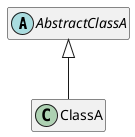
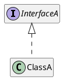
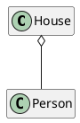
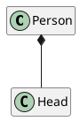
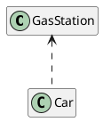

`PlantUML`ではコードからクラス図を作成することができる．


## クラス間の関係

---

#### 1. 継承 Extension

継承関係は `A <|-- B` と記述する．



```
@startuml
abstract class AbstractClassA {}
class ClassA {}

AbstractClassA <|-- ClassA
@enduml
```

または，Javaのように `extends`キーワードを使うこともできる．（Javaに馴染みがないので良く忘れる）

```
@startuml
abstract class AbstractClassA {}
class ClassA extends AbstractClassA {}
@enduml
```

---

#### 2. 実装 Implements
継承関係は `A <-- B` と記述する．



```
@startuml
Interface InterfaceA { }
class ClassA { }

InterfaceA <|.. ClassA
@enduml
```

継承と同様に 実装では`impletemts`を使用できる．

```
@startuml
Interface InterfaceA { }
class ClassA implements InterfaceA { }
@enduml
```

---

#### 3. 集約 Aggregation



---

#### 4. 構成 Composition



---

#### 5. 依存 Dependency




---

#### 6. 内部クラス Inner Class

---

## 参考資料
- qiita: [PlantUML クラス図 早見表](https://qiita.com/kyonc5/items/4d536cb59fd7c41debc1)
- qiita: [PlantUML Cheat Sheet](https://qiita.com/ogomr/items/0b5c4de7f38fd1482a48)
- Real World PlantUML [CLASS](https://real-world-plantuml.com/?type=class)