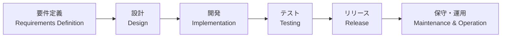

> 
>
> 出典：[技術評論社](https://gihyo.jp/)

---
## はじめに

| 分類         | 開発対象                                 |
| ------------ | ---------------------------------------- |
| 本書の対象   | ・ブラウザを介して利用する社内業務アプリ |
|              | ・一般消費者が利用するECサイト           |
| 本書の対象外 | ・スマホアプリの開発                     |
|              | ・Windowsアプリケーションの開発          |
|              | ・組込みプログラム                       |

古典的で分かりやす`ウォータフォールモデル`をベースに解説している．

**ウォーターフォールの工程**

---

## 1. 「システム設計」の位置付け

システム開発全体におけるシステム設計の立ち位置について

#### 要件定義

#### 設計
- 決めた要件を満たすためのシステムを設計する工程
- 業界・組織・プロジェクトによって，設計工程の呼び方は異なる

#### 開発・テスト

- テストの定石手法は `V字モデル`
- 何の設計に対して，どのようなテストを実施するかが重要

#### リリース

#### 保守・運用

保守 : 利用者の要望や法定要件などに合わせてシステムを改修していくこと
- システム改修

運用 : システムを稼働し続けるために必要な対応を実施すること
- イベント管理
- システム管理
- 障害対応
  

## 2. 「システム設計」とは

`準委任契約`と`請負契約`[^請負契約と準委任]

#### 設計分類
- 全体設計
- アプリ
  - 入出力設計
  - データベース設計
  - ロジック設計
- インフラ
  - ネットワーク設計
  - サーバ設計

※アプリとインフラの設計はかなり毛色が違うことから，明確に体制が分かれることが多い．

#### 設計書の種類
- 管理系
- 俯瞰系
- 個別系

| 分類   | 開発対象                             |
| ------ | ------------------------------------ |
| 管理系 | ・画面一覧                           |
|        | ・テーブル一覧                       |
|        | ・プログラム一覧                     |
| 俯瞰系 | ・システムアーキテクチャ設計         |
|        | ・バッチ全体設計                     |
|        | ・ネットワーク全体構成図（論理構成） |
| 個別系 | ・画面レイアウト                     |
|        | ・テーブルレイアウト                 |
|        | ・サーバ設定仕様書                   |

## 3. 「システム設計」に影響する考え

#### ソフトウェア設計モデル

--- 

## 4. 全体設計

#### システムアーキテクチャ設計
- システム全体の設計方針を設計する
- システム全体の構成要素とそれらの相互関係を明確にする
- インプットとして`信頼性・安全性設計`が必要

#### 信頼性・安全性設計
システムが信頼でき，かつ安全に利用できるための仕組みを設計する．

- 有効な指標に`RAISIS(レイシス)`がある

| 頭文字 | 単語            | 概要                                                 |
| ------ | --------------- | ---------------------------------------------------- |
| R      | Reliabilty      | 信頼性．故障しにくいこと．                           |
| A      | Availability    | 可用性．稼働し続けること．                           |
| S      | Serviceablility | 保守性．障害からの復旧時間やメンテナンスのしやすさ． |
| I      | Integrity       | 保全性．データの矛盾がなく一貫性を保っていること．   |
| S      | Security        | 安全性．機密性が高く，故障しにくいこと．             |

#### 環境設計
システム全体の土台を合わせることで，効率的かつ安定的に機能できるようにすることを目的とする．

#### 性能設計
システムを快適かつ効率的に動作させるために，どのような部位でどのような対策をするのかを設計する．

#### セキュリティ設計
システム全体の安全性を確保し，機密性・完全性・可用性を維持するために不可欠．

- 情報セキュリティの３要素(CIA)

| 要素   | 概要                                     | 脅威例                                                                                   |
| ------ | ---------------------------------------- | ---------------------------------------------------------------------------------------- |
| 機密性 | 正当な権利を持った人だけが使用できること | ・権利がないユーザーが情報を取得できてしまう． ・不正にログインされ情報漏洩する．     |
| 完全性 | 改ざんされていないことを確実にすること   | ・フィッシングサイトに遷移する処理を埋め込まれる                                         |
| 可用性 | 必要な時に使用できること                 | ・ランサムウェアに攻撃され，利用できなくなる． ・DDoS攻撃を受け，使えない状態に陥る． |

#### 運用方式設計
システムを効率的かつ効果的に運用できるようにするための設計．

#### 外部接続方式設計
システムが外部のサービスやシステムと適切に連携・通信できるように設計を行う．

#### 標準化設計
各種基本ルールを整備することで，開発者間の認識のズレを減らし，効率よく開発を進めることができる．

#### テスト方式設計
テスト方式を規定することで，すべてのアプリ・インフラの品質を確保し，かつ効率的に実施することができる．

#### 移行方式設計
現システムから新システムへの移行方法を明確にすることで，必要となるタスクを洗い出す．

---

## 5. 入出力設計

入力設計は `画面系`，`帳票系`，`IF系` に分類できる．

## 6. データベース設計

- 全般
  - ボリューム一覧
- RDB
  - データベース設定
  - テーブル一覧
  - インデックス一覧
  - ER図
  - テーブルレイアウト
  - CRUD図
- NoSQL
  - データベース設定
  - データ一覧
  - データレイアウト
- ファイル
  - ファイル一覧
  - ファイル設計

## 7. ロジック設計

- ユースケース図
- アクティビティ図
- クラス図
- シーケンス図
- 処理フロー図
- 状態遷移設計
- バッチ全体設計
- 処理設計（プログラム仕様書）

## 8. ネットワーク設計
ネットワーク設計は採用した機器やプロダクトがベースにあり，それらの仕様に沿ってどのように組み立てるか，どのような設定をするか，が主となる．

## 9. サーバ設計
ネットワークと同様に，サーバにおいても機器やプロダクトがベースにあるので，それらを最適に組み合わせていく形となる．

---

## 10. 設計書の活用

--- 

## 所感

書籍冒頭でアプリ開発等は本書の対象ではないという文言があり，肩透かしを食らった．とはいえ，システム設計について広く情報を得られたと思う．これまでのイメージでは「設計 = 本書でいうロジック設計」という印象が強かったため，視点を上げることができたと思う．あと色々な名称が出てきて，「あの資料ってそういう名前なんだ」ってなった．

一方で，幅広い範囲を扱っているがゆえに，各設計書を紹介するにとどまっているように思えた．少なくとも，カッチリした開発経験のない自分には具体的にどのように設計書を作っていけばよいかイメージを持てなかった．

もう少し経験をつんでから読み返すと印象が違いそうではある．

## 参考記事

[^請負契約と準委任]: 請負契約と準委任契約 https://www.it-houmu.com/archives/1459

<!--  -->
