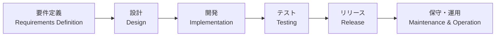

| 分類         | 開発対象                                 |
| ------------ | ---------------------------------------- |
| 本書の対象   | ・ブラウザを介して利用する社内業務アプリ |
|              | ・一般消費者が利用するECサイト           |
| 本書の対象外 | ・スマホアプリの開発                     |
|              | ・Windowsアプリケーションの開発          |
|              | ・組込みプログラム                       |

古典的で分かりやす`ウォータフォールモデル`をベースに解説している．

**ウォーターフォールの工程**

---

## 1. 「システム設計」の位置付け

システム開発全体におけるシステム設計の立ち位置について

#### 要件定義

#### 設計
- 決めた要件を満たすためのシステムを設計する工程
- 業界・組織・プロジェクトによって，設計工程の呼び方は異なる

#### 開発・テスト

- テストの定石手法は `V字モデル`
- 何の設計に対して，どのようなテストを実施するかが重要

#### リリース

#### 保守・運用

保守 : 利用者の要望や法定要件などに合わせてシステムを改修していくこと
- システム改修

運用 : システムを稼働し続けるために必要な対応を実施すること
- イベント管理
- システム管理
- 障害対応
  

## 2. 「システム設計」とは

`準委任契約`と`請負契約`[^請負契約と準委任]

#### 設計分類
- 全体設計
- アプリ
  - 入出力設計
  - データベース設計
  - ロジック設計
- インフラ
  - ネットワーク設計
  - サーバ設計

※アプリとインフラの設計はかなり毛色が違うことから，明確に体制が分かれることが多い．

#### 設計書の種類
- 管理系
- 俯瞰系
- 個別系

| 分類   | 開発対象                             |
| ------ | ------------------------------------ |
| 管理系 | ・画面一覧                           |
|        | ・テーブル一覧                       |
|        | ・プログラム一覧                     |
| 俯瞰系 | ・システムアーキテクチャ設計         |
|        | ・バッチ全体設計                     |
|        | ・ネットワーク全体構成図（論理構成） |
| 個別系 | ・画面レイアウト                     |
|        | ・テーブルレイアウト                 |
|        | ・サーバ設定仕様書                   |

## 3. 「システム設計」に影響する考え

#### ソフトウェア設計モデル

--- 

## 4. 全体設計

#### システムアーキテクチャ設計
- システム全体の設計方針を設計する
- システム全体の構成要素とそれらの相互関係を明確にする
- インプットとして`信頼性・安全性設計`が必要
- 

#### 信頼性・安全性設計

- 有効な指標に`RAISIS(レイシス)`がある

| 頭文字 | 単語            | 概要                                               |
| ------ | --------------- | -------------------------------------------------- |
| R      | Reliabilty      | 信頼性．故障しにくいこと．                         |
| A      | Availability    | 可用性．稼働し続けること．                         |
| S      | Serviceablility | 保守性．障害からの復旧時間やメンテナンスのしやすさ |
| I      | Integrity       | 保全性．データの矛盾がなく一貫性を保っていること   |
| S      | Security        | 安全性．きみつ                                     |

#### 環境設計

#### 性能設計

#### セキュリティ設計

#### 運用方式設計

#### 外部接続方式設計

#### 標準化設計

#### テスト方式設計

#### 移行方式設計

---

## 5. 入出力設計

## 6. データベース設計

## 7. ロジック設計

## 8. ネットワーク設計

## 9. サーバ設計

---

## 10. 設計書の活用

--- 

## 所感

書籍冒頭で，アプリ開発等は本書の対象ではないという文言があり，盛大に肩透かしを食らった．

## 参考記事

[^請負契約と準委任]: 請負契約と準委任契約 https://www.it-houmu.com/archives/1459

<!--  -->