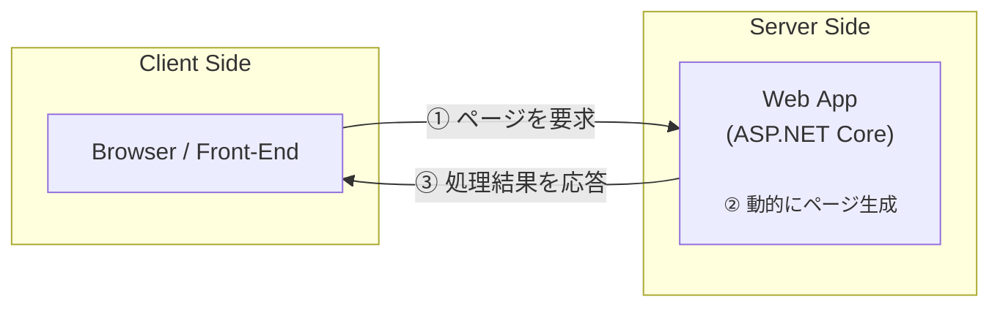
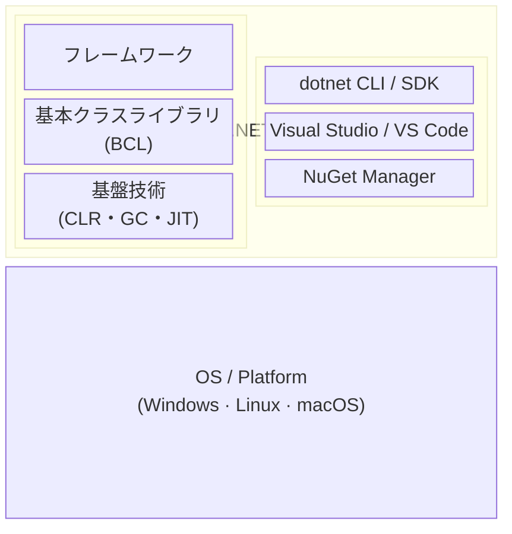
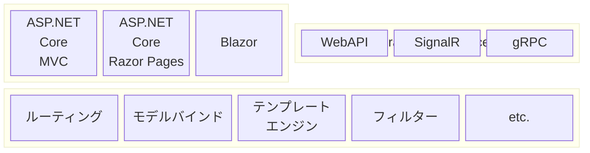

---
## 1. イントロダクション

- [x] ASP.NET Coreの全体像
- [x] ASP.NET Core利用のための環境設定

#### ASP.NET Core とは

`ASP.NET Core` は `.NET` 環境で動作する**サーバーサイド**のアプリケーションフレームワーク．




###### .NET の構造



- **CLR** (共通言語ランタイム) : `.NET`アプリが共通で利用する実行エンジン．言語やプラットフォームの差異を吸収しくくれる．
- **基本ライブラリ** : .NET言語から共通して呼び出せるライブラリ．
- **フレームワーク** : 


###### .NET ASP Core の全体像




---
## 2. ASP.NET Core MVC の基本

- [x] コントローラの基本
- [x] ビューの基本
- [x] モデルの基本 


#### アプリの実行

プロジェクトディレクトリで以下のコマンドを実行すると，アプリを起動することができる．
停止する際は `Ctrl` + `C` でシャットダウンする．

```bash
dotnet watch
```

#### コントローラ

コントローラクラスは以下をいずれかを満たす必要がある．
- `System.AspNet.Mvc.Controller` クラスする．
- クラス名の接尾辞として「Contoller」が付く
- クラスに `Controller` 属性が適用されている．


コントローラにはクライアントからのリクエストを処理するための**アクションメソッド**を定義する．アクションメソッドは以下の特徴がある．
  - アクセス修飾子はpublicにする．
  - 返り値は`IActionResult` を返す． 


基本的に`System.AspNet.Mvc.Controller`クラスのヘルパーメソッドを利用する．
| メソッド | 概要                                 |
| -------- | ------------------------------------ |
| Content  | 指定のテキストを出力                 |
| View     | テンプレートによる結果を出力         |
| File     | 指定のバイト配列をファイルとして出力 |
| Redirect | 指定アドレスにリダイレクト           |
| NotFound | 404 NotFound ステータスを生成        |


###### ルーティング

`program.cs` で最低限の設定を行える．以下のコードでは，`default`という名前で `{controller}/{action}/{id}`のURLパターンを登録している．

```cs
var builder = WebApplication.CreateBuilder(args);
builder.Services.AddControllersWithViews();
var app = builder.Build();
  
  :

// ルーティング
app.MapControllerRoute(
  name: "default",
  pattern: "{controller=Home}/{action=Index}/{id?}");
```

- パラメータの名前・数は自由
- 既定値と省略可能なパラメータ


#### ビュー

`Razor` はHTMLにC#コードを埋め込むための仕組み（ビューエンジン）．`Razor Pages`や`Blazor`デモ共通して利用される仕組みであり，以下の特徴を持つ

```cs

```

- C#の標準的な構文で，条件分岐・ループなどを表現できる．
- ビュー共通の機能，テンプレートを再利用するための仕組みを備える．
- タグヘルパー（ビュー生成のための仕組み）を利用することで，フォーム・リンクなどをよりシンプルに開発できる．


###### Razorテンプレート

Razorを利用する場合のコントローラアクションとRazorテンプレートの役割
  - アクション側 : 表示に必要な値を**ビュー変数**に設定する．
  - テンプレート側 : データを埋め込む場所や表示方法などを指定する． 

```cs
public class HelloController : Controller{
  
  public IActionResult Show(){
    ViewBag.Message = "こんにちは，世界！";   // (1) ビュー変数の準備
    return View();                            // (2) Razorテンプレートの呼び出し
  } 
}
```

`ViewBag`はdynamic型で定義されており，**ビュー変数**は`ViewBag`のプロパティとして設定できる．また，ディクショナリの`ViewData`で設定することも可能．

```cs
ViewBag.変数名 = 値;
```
```cs
ViewData["変数名"] = 値;    // こちらは文字キーなので，変数名に"-"を含めることもできる
```


テンプレート側では以下のようにビュー変数を参照する． 値の取得には`@...`，処理の実行には `@{}` を使用する． 

```cshtml
@{
    ViewData["Title"] = "Show";
}
<p>@ViewBag.Message</p>     @* ビュー変数を表示 *@
```


#### モデル

###### データモデルの生成
1. エンティティを定義する
2. コンテキストクラスを準備する
3. データベース接続文字列を定義する
4. アプリにコンテキストを登録する

エンティティの定義
- クラス（単数形）は，同名のテーブル（複数形）にマッピングする．
- プロパティは，同名のテーブル列にマッピングする．
- Id，または{エンティティ名}Idプロパティは主キーに設定する．
- プロパティがnullを許容するばあはNull許容列，許容しない場合にはNotNull列にする．


###### データベースの作成


###### データアクセスの基本

```cs
public class HelloController : Controller{
  
  private readonly MyContext _db;
  
  public HelloController(MyContext db) {    // DIで参照が注入される
      _db = db;
  }
  
  public IActionResult List(){
      var books = _db.Books;  // DBへアクセス
      return View(books);     // View()の引数に渡してテンプレートを呼び出す
  }
  
}
```


---
## 3. Scaffolding機能

- [x] Scaffolding機能の実行


#### Scaffoldingとは

`Scaffolding (スキャフォールディング)` と呼ばれる仕組みを利用することで，CRUD機能を備えたアプリを半自動で作成できるようになる．

`Scaffolding`機能を利用するには，ターミナルで `dotnet aspnet-codegenerator` コマンドを実行する．また，`ASP.NET Core MVC` でCRUDを伴うコントローラを作成するなら，`controller` サブコマンドを利用する．

```bash
dotnet aspnet-codegenerator controller -name BooksController -outDir Controllers -async -m Book -dc MyContext -udl -scripts
```

```
SelfAspNet/
├─ Controllers/
│  └─ BooksController.cs     ←  非同期 CRUD アクション付き
├─ Data/                      ← まだ無ければ自動生成
│  └─ MyContext.cs           ← DbContext 派生クラス  :contentReference[oaicite:0]{index=0}
├─ Views/
    └─ Books/                 ← CRUD ビュー 5 枚
        ├─ Create.cshtml
        ├─ Edit.cshtml
        ├─ Delete.cshtml
        ├─ Details.cshtml
        └─ Index.cshtml
```


#### Indexアクション

```cs
public class BooksController : Controller {
    
    private readonly MyContext _context
    
    public async Task<IActionResult> Index() {
        return View(await _context.Books.ToListAsync());
    }
}
```

非同期アクションでは `Task<IActionResult>` を返す．データベースへのアクセスなど，オーバーヘッドの大きい処理では積極的にアクションを非同期化すべき．

また，`_context.Books` では`IEnumerable<Book>` が返される**遅延実行**だが， `ToListAsync()` でのリスト変換で**即時実行**化している．


#### Detailアクション

```cs
public async Task<IActionResult> Edit(int? id) {
			// idが無指定，書籍情報が得られない場合は，404エラー
      if (id == null)
				return NotFound();

      // Booksテーブルを検索
			var book = await _context.Books.FindAsync(id);
			// データが見つからない場合は，404エラー
			if (book == null)
				return NotFound();
        
			return View(book);
		}
```

アクションメソッドでは，リクエストデータと同名の引数を用意しておくことで，対応する自動で割り当てることができる．このようなパラメータ割り当ての仕組みを**モデルバインド**と呼ぶ．

| 種類             | 概要                                                    |
| ---------------- | ------------------------------------------------------- |
| ポストデータ     | <form method="POST"> 形式のフォームから送信されるデータ |
| クエリ情報       | URLの末尾に「?キー名=値」形式で付与された情報           |
| ルートパラメータ | ルーティング情報で定義されたパラメータ                  |

条件に合致するデータが見つからない場合には，`NotFound()`アクションで「404 Not Found」用のIActionResult型を返す．

#### Editアクション


--- 
## 4. ビュー開発

- [ ] Razorの基本構文


| 分類   | 命令                   | 概要                       |
| ------ | ---------------------- | -------------------------- |
| 分岐   | @if / else if / else   | キストを出力               |
|        | @switch                | キストを出力               |
| ループ | @for                   | 指定された回数だけ繰り返し |
|        | @foreach               | リストの内容を繰り返し     |
|        | @while                 | 条件式がtrueの間，繰り返し |
|        | @do...while            | 条件式がtrueの間，繰り返し |
| その他 | @using                 | オブジェクトの自動破棄     |
|        | @try...catch...finally | 例外処理                   |
|        | @lock                  | 処理のロック               |


--- 
## 5. モデル開発

- [ ] エンティティの定義
- [ ] LINQ to Entities
- [ ] CRUD

--- 
## 6. コントローラ開発 

- [ ] モデルバインド

--- 
## 7. ASP.NET Coreアプリの構造

- [ ] 依存性注入


--- 
## 8. ミドルウェア

- [ ] ルーティング
- [ ] 状態管理
- [ ] エラーページ
- [ ] 静的リソース


--- 
## 9. ASP.NET Core の主なサブフレームワーク

- [ ] Razor Pages
- [ ] ASP.NET Core Web API
- [ ] SPAプロジェクト


---

## その他

#### VSCode

VSCodeの拡張機能 `ASP.NET Core Snippets` を導入していれば，`mvc-...`でスニペットを利用できる．

主なスニペット
| キーワード             | 概要                                 |
| ---------------------- | ------------------------------------ |
| HomeController         | コントローラクラス                   |
| mvc-core-xxxxx         | CRUDアクション (get,post,put,delete) |
| mvc-core-async-action  | 非同期アクション                     |
| mvc-core-xxxx-async    | CRUDアクション (非同期)              |
| app-map                | ルーティング                         |
| dbContext-UseSqlServer | SQL Server利用の宣言                 |
| appsettings            | アプリ設定                           |


---


<!-- Link -->
[ASP.NET ドキュメント]: https://learn.microsoft.com/ja-jp/aspnet/core/?view=aspnetcore-9.0
