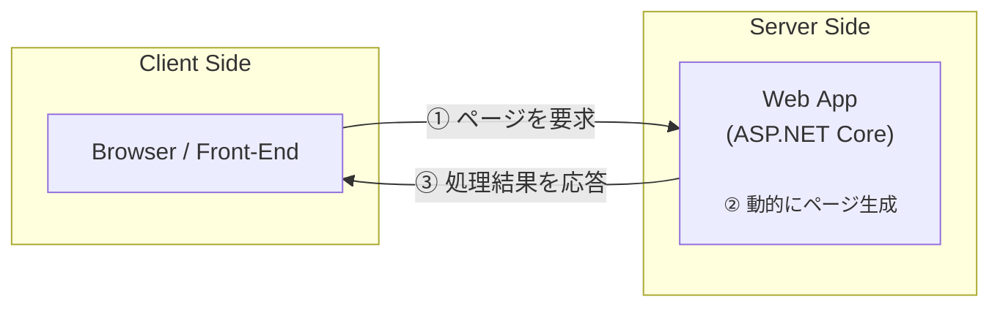
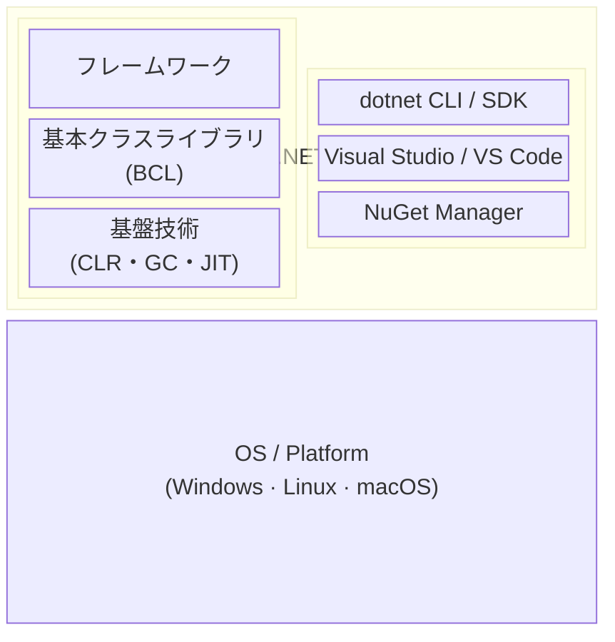
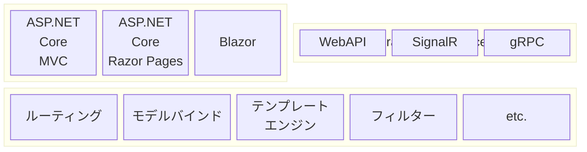

---
## 1. イントロダクション

- [x] ASP.NET Coreの全体像
- [ ] ASP.NET Core利用のための環境設定

#### ASP.NET Core とは

`ASP.NET Core` は `.NET` 環境で動作する**サーバーサイド**のアプリケーションフレームワーク．




###### .NET の構造



- **CLR** (共通言語ランタイム) : `.NET`アプリが共通で利用する実行エンジン．言語やプラットフォームの差異を吸収しくくれる．
- **基本ライブラリ** : .NET言語から共通して呼び出せるライブラリ．
- **フレームワーク** : 


###### .NET ASP Core の全体像




---
## 2. ASP.NET Core MVC の基本

- [ ] コントローラの基本
- [ ] ビューの基本
- [ ] モデルの基本 


#### アプリの実行

プロジェクトディレクトリで以下のコマンドを実行すると，アプリを起動することができる．
停止する際は `Ctrl` + `C` でシャットダウンする．

```bash
dotnet watch
```

#### コントローラ

コントローラクラスは以下をいずれかを満たす必要がある．
- `System.AspNet.Mvc.Controller` クラスする．
- クラス名の接尾辞として「Contoller」が付く
- クラスに `Controller` 属性が適用されている．


`IActionResult` を返す `System.AspNet.Mvc.Controller`クラスのヘルパーメソッド．

| メソッド | 概要                                 |
| -------- | ------------------------------------ |
| Content  | 指定のテキストを出力                 |
| View     | テンプレートによる結果を出力         |
| File     | 指定のバイト配列をファイルとして出力 |
| Redirect | 指定アドレスにリダイレクト           |
| NotFound | 404 NotFound ステータスを生成        |


---
## 3. Scaffolding機能

- [ ] Scaffolding機能の実行


--- 
## 4. ビュー開発

- [ ] Razorの基本構文

--- 
## 5. モデル開発

- [ ] エンティティの定義
- [ ] LINQ to Entities
- [ ] CRUD

--- 
## 6. コントローラ開発 

- [ ] モデルバインド

--- 
## 7. ASP.NET Coreアプリの構造

- [ ] 依存性注入


--- 
## 8. ミドルウェア

- [ ] ルーティング
- [ ] 状態管理
- [ ] エラーページ
- [ ] 静的リソース


--- 
## 9. ASP.NET Core の主なサブフレームワーク

- [ ] Razor Pages
- [ ] ASP.NET Core Web API
- [ ] SPAプロジェクト


---

## その他

#### VSCode

VSCodeの拡張機能 `ASP.NET Core Snippets` を導入していれば，`mvc-...`でスニペットを利用できる．

主なスニペット
| キーワード             | 概要                                 |
| ---------------------- | ------------------------------------ |
| HomeController         | コントローラクラス                   |
| mvc-core-xxxxx         | CRUDアクション (get,post,put,delete) |
| mvc-core-async-action  | 非同期アクション                     |
| mvc-core-xxxx-async    | CRUDアクション (非同期)              |
| app-map                | ルーティング                         |
| dbContext-UseSqlServer | SQL Server利用の宣言                 |
| appsettings            | アプリ設定                           |


---


<!-- Link -->
[ASP.NET ドキュメント]: https://learn.microsoft.com/ja-jp/aspnet/core/?view=aspnetcore-9.0
