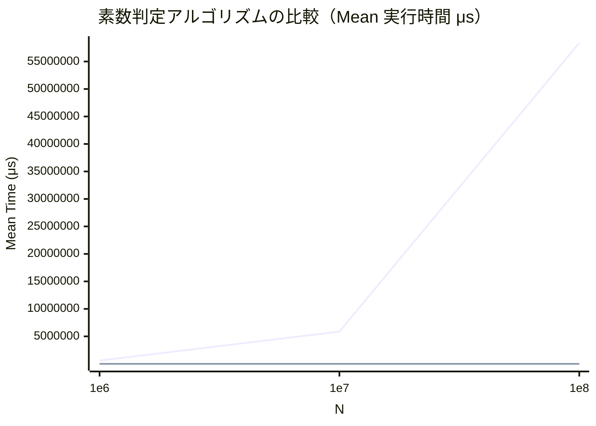

基本的なアルゴリズムの理解を深めつつ、`BenchmarkDotNet`を使ったパフォーマンス検証と、`mermaid`によるグラフ作成の練習も兼ねた壁打ちメモ．

## 素数とは

> 素数（そすう、英: prime あるいは prime number）とは、2 以上の自然数で、正の約数が 1 とその数自身のみであるもののことである。正の約数の個数が 2 である自然数と言い換えることもできる。1 より大きい自然数で素数でないものは合成数と呼ばれる。例えば、5 は素数である。なぜなら、5 を自然数の積として書くには、「1×5」か「5×1」しかないからである。しかし、4 を自然数の積で表すと、「1×4」、「4×1」の他に「2×2」があり、両方の数が4より小さいので合成数である。よって素数ではない。

---

## 実装

#### 1. 単純な素数判定法

`2`から`n-1`までの全ての値で割り切れるかを調べていく．

```cs
public bool IsPrime(long n) {
  if (n < 2) return false;

  for (long i = 2; i < n; i++) {
    if (n % i == 0) return false;
  }
  return true;
}
```

- 計算量：**O(n)**
- 特徴：実装は簡単だが，非常に非効率．n=10^8 などでは実用的でない．


#### 2. 高速な素数判定法（√nまでの試し割り）

任意の合成数は，少なくとも1つの約数が √n 以下に存在するため，
2 から √n までの範囲で割り切れるかを調べれば十分．

```cs
public bool IsPrimeOptimized(long n) {
    if (n < 2) return false;

    for (long i = 2; i * i <= n; i++) {
        if (n % i == 0) return false;
    }
    return true;
}
```

- 計算量：**O(√n)**
- 特徴：大きな数に対して非常に高速．実用的な判定法．

---

## 検証

#### 検証コード

```cs
[MemoryDiagnoser]
[MarkdownExporter, HtmlExporter]
[Config(typeof(SlimConfig))]
public class PrimeBenchmarks {
  private Calculator _calculator = new Calculator();

  [Params(100_000_039, 1_000_000_007, 10_000_000_019)] // すべて素数
  public long N;

  [Benchmark]
  public bool Naive_IsPrime() => _calculator.IsPrime(N);

  [Benchmark]
  public bool Optimized_IsPrime() => _calculator.IsPrimeOptimized(N);

  private class SlimConfig : ManualConfig {
    public SlimConfig() {
      AddJob(Job.Default
        .WithWarmupCount(1)     // ウォームアップの回数（デフォルトは1〜5）
        .WithIterationCount(3)  // 計測回数
        .WithInvocationCount(1) // 1回のイテレーション内で何回メソッドを呼ぶか。
        .WithUnrollFactor(1)    // ループの展開数
      );
    }
  }
}
```

#### ベンチマーク結果

| Method            | N           |             Mean |           Error |         StdDev |
| ----------------- | ----------- | ---------------: | --------------: | -------------: |
| Naive_IsPrime     | 100000039   |    589,510.57 us |    21,630.27 us |   1,185.628 us |
| Optimized_IsPrime | 100000039   |         71.33 us |        14.63 us |       0.802 us |
| Naive_IsPrime     | 1000000007  |  5,872,116.23 us |   321,974.50 us |  17,648.509 us |
| Optimized_IsPrime | 1000000007  |        202.13 us |        83.21 us |       4.561 us |
| Naive_IsPrime     | 10000000019 | 58,376,900.43 us | 3,419,161.02 us | 187,415.754 us |
| Optimized_IsPrime | 10000000019 |        620.00 us |        55.67 us |       3.051 us |


#### 可視化



`mermaid`で棒グラフを作るのは結構厳しいかも．


## 参考資料
- wiki: [素数](https://ja.wikipedia.org/wiki/%E7%B4%A0%E6%95%B0)
- wiki: [素数判定](https://ja.wikipedia.org/wiki/%E7%B4%A0%E6%95%B0%E5%88%A4%E5%AE%9A)
- qiita: [素数判定アルゴリズムいろいろ](https://qiita.com/ppza53893/items/e0f464340d6f97760cd5)