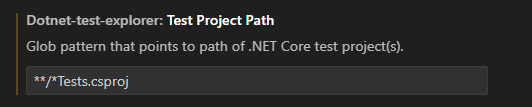

`VS Code`で`.NET`開発環境を整える手順についてのメモ．


## .NET のインストール手順

#### ダウンロード

[公式ページ](https://dotnet.microsoft.com/ja-jp/download/dotnet)から `.NET` をダウンロードする．

#### インストール


#### 確認

以下のコマンドで正常にインストールできているか確認できる．

```
dotnet --info
```


## 


## プラグイン導入

#### [C# Dev Kit][拡張機能 C# Dev Kit]


- [プロジェクト管理](https://code.visualstudio.com/docs/csharp/project-management) : 

#### [C#][拡張機能 C#]

`C# Dev Kit`をインストールすると，必須の依存関係として自動的にインストールされる．

- [リファクタリング](https://code.visualstudio.com/docs/csharp/refactoring) : 
- [ナビゲーション](https://code.visualstudio.com/docs/csharp/navigate-edit) :
- インテリセンス:
- フォーマット: 


#### [.NET Core Test Explorer][拡張機能 .NET Core Test Explorer]

Unitテスト用の拡張機能．設定からテスト対象プロジェクトのパスを指定する必要がある．

```
**/*Tests.csproj
```



## ソリューションの作成

```
dotnet new console -n {YoutProjectName}
```

```
cd YourProjectName
code .
```

以下のような構成でソリューションとプロジェクトが生成される
```
MySolution/
├── MySolution.sln
└── MyProject/
```


## 公式資料
- [Using .NET in Visual Studio Code](https://code.visualstudio.com/docs/languages/dotnet)
- MS Learn: [dotnet コマンド](https://learn.microsoft.com/ja-jp/dotnet/core/tools/dotnet)

## 参考記事
- qiita: [Windows 11 の VSCode の .NET 8 開発環境の構築方法](https://qiita.com/mmake/items/6748ad531ca7bd44a8ce)
- zenn: [VSCodeでC#開発をする方法](https://zenn.dev/midoliy/articles/9e3cff958ff89ba151de)
- zenn: [VSCodeでC#のUnit Testを書けるようにするためのセットアップ](https://zenn.dev/yuriemori/articles/f6a73b326a3f0f)


<!-- Link | VSCode拡張機能 -->
[拡張機能 C# Dev Kit]: https://marketplace.visualstudio.com/items?itemName=ms-dotnettools.csdevkit
[拡張機能 C#]: https://marketplace.visualstudio.com/items?itemName=ms-dotnettools.csharp
[拡張機能 .NET Core Test Explorer]: https://marketplace.visualstudio.com/items?itemName=formulahendry.dotnet-test-explorer
[拡張機能]
[拡張機能]
[拡張機能]
[拡張機能]