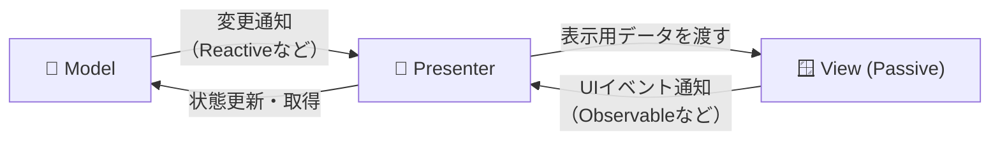
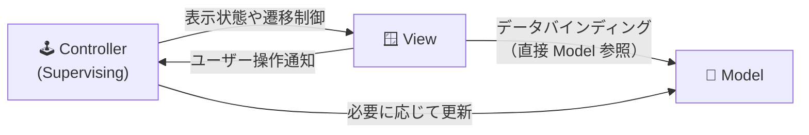

ロジック(`Model`) と 画面（`View`）を分離する設計パターンとして，`MVC`，`MVP`，`MVVM`などがあるかと思う．

特にUnityにおいては `MVRP(Reactive MVP)` が使われることが多いと思う．

---
## 前提

Unityでの開発を対象としているので，

- ViewはUI要素(`uGUI`，`UI Toolkit`)とする．
  - MonoBehaviourを継承するもの全てがViewとは考えない
  - ここでのUI要素にプレイヤー操作入力機器（マウスやコントローラ）は含めまれない
- `UniRx`，`R3`などのRxライブラリを使用できる．

- UIはPrefabによってコンポーネント化される．
- 

---
## MVC (Model - View - Controller)

---
## MVP (Model - View - Presenter)

MVPには `Passive View` と `Supervising Controller` が存在する．

#### Passive View

#### Supervising Controller

--- 
## MVVM (Model - View - ViewModel)

## 参考資料
- qiita: [Webアプリケーション開発者から見た、MVCとMVP、そしてMVVMの違い](https://qiita.com/shinkuFencer/items/f2651073fb71416b6cd7)
- qiita: [StackOverFlowの「MVPとMVCの違い」についての回答を読んでみた](https://qiita.com/takahirom/items/597c48ece57b4623cdee)
