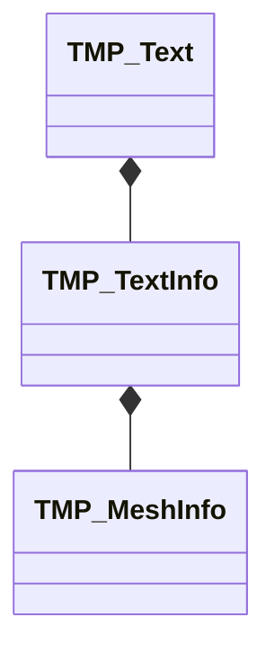

## 概要
`TextMeshPro`はフォントのアトラスを参照し，設定した文字列の1文字毎に板ポリゴンに描画する方法で文字を表示していいる．


## 

は[`TMP_TextInfo`][TMP_TextInfo]を保持しており，この中に文字毎の情報として`TMP_MeshInfo`と`TMP_CharacterInfo`の配列をそれぞれ保持している．




```cs
TMP_Text text;
TMP_TextInfo textInfo = text.textInfo;


```


## 参考資料
hatena: [【Unity】TextMesh Proをアニメーションさせる～プログラマ編～](https://coposuke.hateblo.jp/entry/2020/06/07/020330)
note: [【Unity】TextMeshProをいっぱい動かす](https://note.com/logic_magic/n/ncef582c3a454)
_: [TextMeshProでテキストアニメーションを実装する](https://logicalbeat.jp/blog/15431/)


<!-- リンク | ドキュメント -->
[TMP_Text]: https://docs.unity3d.com/Packages/com.unity.textmeshpro@4.0/api/TMPro.TMP_Text.html
[TMP_TextInfo]: https://docs.unity3d.com/Packages/com.unity.textmeshpro@4.0/api/TMPro.TMP_TextInfo.html

