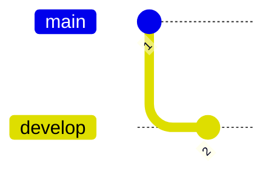
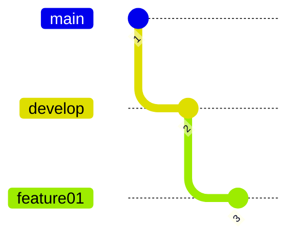
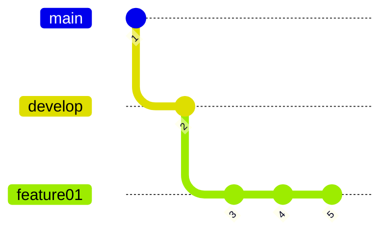

Gitでブランチを切って開発をするにあたって，`git flow`，`github flow` という考え方があるらしい．

> 
> 引用： [A successful Git branching model][A successful Git branching model]

---
## 運用

1. `develop`を作成する

2. 機能開発の準備を行う
   - `develop`から`feature` を作成する．`feature`は機能毎に作る．

3. 機能開発を行う
   - `feature` にコミットしていく．

4. 開発中の最新状態を`feature`に取り込む
   - `feature` にコミットしていく．

---

- `main`
- `develop`
- `feature`
- `release`
- `hotfixes`

---
## メインブランチ

---
## サポートブランチ

#### フィーチャーブランチ

#### リリースブランチ

---
## 参考資料
- qiita: [git-flow 図解](https://qiita.com/yuki0410_/items/7c7fa20710dfd72b7d7a)
- qiita: [git flowとgithub flowとは？その違いは？](https://qiita.com/mint__/items/bfc58589b5b1e0a1856a)
- GitHub Gist: [github-flow.ja.md](https://gist.github.com/Gab-km/3705015)
- zenn: [マージ前にベースブランチの変更の取り込みを必須化することでコード品質を向上させる](https://zenn.dev/babyjob/articles/a454409efdb5b7)

<!-- Link -->
[A successful Git branching model]: https://nvie.com/posts/a-successful-git-branching-model/
[A successful Git branching model（翻訳）]: https://keijinsonyaban.blogspot.com/2010/10/a-successful-git-branching-model.html 
