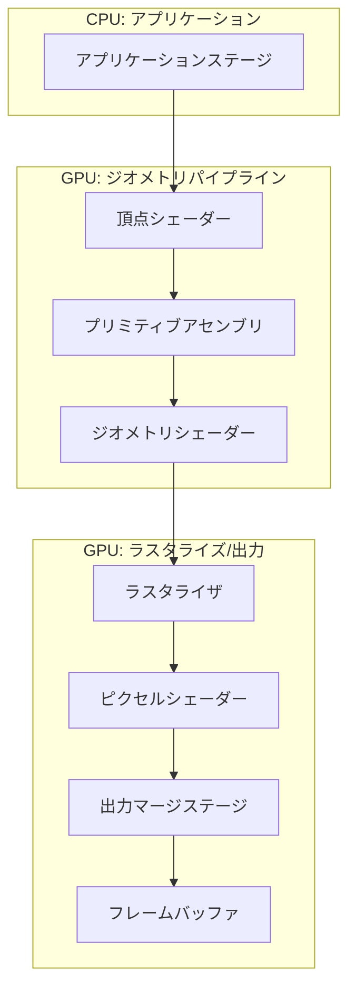

---
## CPUとGPU


---
## メインメモリとグラフィックスパイプライン


疑似コード
```
// 描画対象の情報を設定
SetVertexBuffer(dogVertexBuffer);
SetTexture(dogTexture);

// ドローコールを実行
Draw();
```


---
## レンダリングパイプライン

CPUからドローコールが実行されると，そのタイミングからGPUが絵を描き始める．このとき，GPUが絵を描くための手順がレンダリングパイプラインである．





1. 入力アセンブラー : 
2. 頂点シェーダー : 
3. ラスタライザー : 
4. ピクセルシェーダー : 


---

## 参考文献
- CG-ARTS: [コンピュータグラフィックス](https://www.cgarts.or.jp/books_detail/ece_1/)
- 