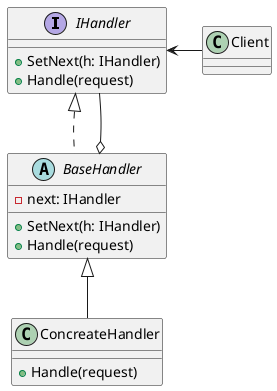

## 概要

**Chain of Responsibility（責任の連鎖）** は，振る舞いに関するデザインパターンの１つで，，**ハンドラーの連鎖**に沿ってリクエストを渡すことができる． 各ハンドラーは，，リクエストを受け取ると，，リクエストを処理するか、 連鎖内の次のハンドラーに渡すかを決める．

## 構造

- `IHandler`
  - すべての具象ハンドラに共通するインタフェース．
  - 通常はリクエストを処理するためのメソッドやのみを含む

- `BaseHandler`
  - 子要素を持たないツリー要素．

- `Concreate Handler`
  - リクエストを処理するための実コードをもつ．
  - 自身で処理出来ない場合は，連鎖に沿ってリクエストを次のハンドラへ委譲する．

## 適用例
`Chain of Responsibility`パターンは、フィルターやイベント・チェーンのようなオブジェクトの連鎖を対象に動作するコードを書く時に用いられる．

## 他パターンとの関連

- `Chain of Responsibility`は階層構造を構築する`Composite`と合わせて用いられており，トップダウン，またはボトムアップで処理を連鎖させていく．

- 「処理の連鎖」という点で`Chain of Responsibility`と`Decorator`は類似している．

## まとめ

## 参考資料
- [Guru: Chain of Responsibility](https://refactoring.guru/ja/design-patterns/chain-of-responsibility)
- [wiki: Chain of Responsibility パターン](https://ja.wikipedia.org/wiki/Chain_of_Responsibility_%E3%83%91%E3%82%BF%E3%83%BC%E3%83%B3)
- [_: Jave Chain of Responsibilityパターン](https://programming-tips.jp/archives/a3/64/index.html)

[ss]: ss